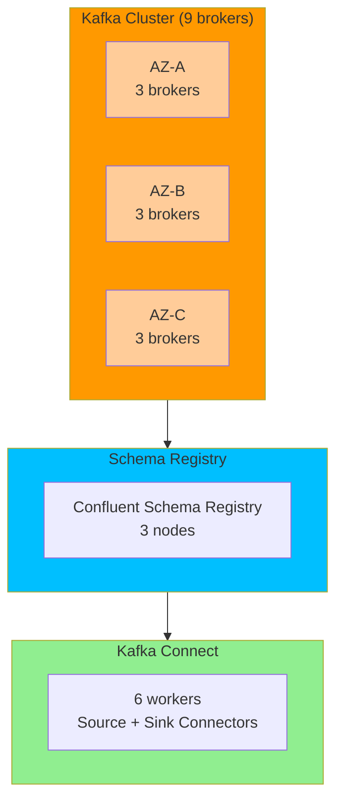
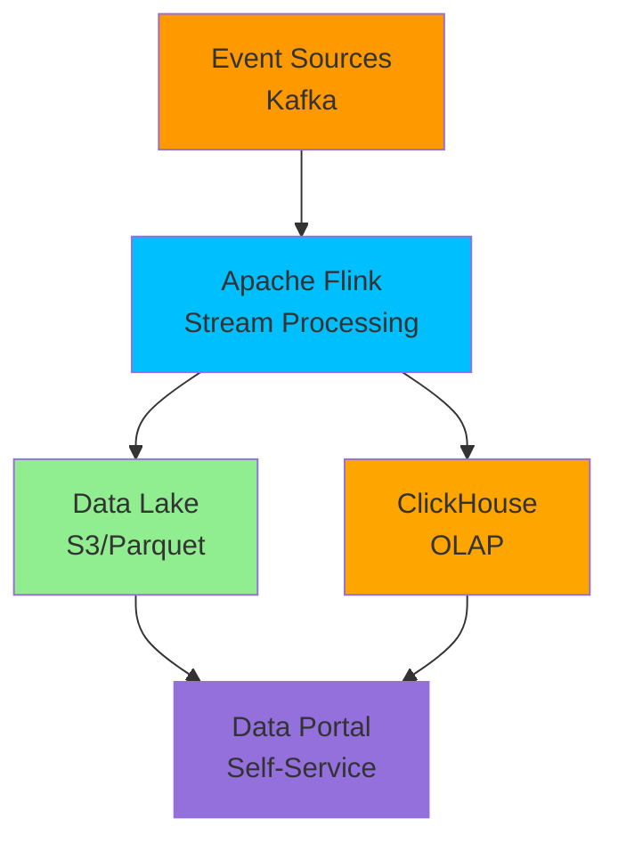
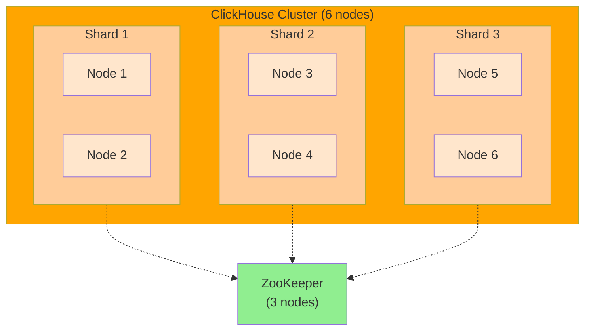

# Архитектурные решения и обоснования

## Оглавление
1. [Общие принципы](#общие-принципы)
2. [Доменная архитектура](#доменная-архитектура)
3. [Событийная архитектура](#событийная-архитектура)
4. [Платформа данных](#платформа-данных)
5. [Технологический стек](#технологический-стек)
6. [Миграционная стратегия](#миграционная-стратегия)

---

## Общие принципы

### 1. Domain-Driven Design (DDD)

**Решение:** Разделение системы на bounded contexts по бизнес-доменам

**Обоснование:**
- **Независимость**: Каждый домен может развиваться независимо
- **Масштабируемость**: Легко добавлять новые бизнес-направления
- **Понятность**: Код отражает бизнес-логику
- **Команды**: Отдельные команды для каждого домена

**Выделенные домены:**
```
1. Medical Domain (Медицинский)
   - Patient Management (Управление пациентами)
   - Appointment Scheduling (Запись на прием)
   - Electronic Medical Records (ЭМК)
   - Medical Imaging (Медицинские снимки)

2. Fintech Domain (Финансовый)
   - Account Management (Управление счетами)
   - Payment Processing (Обработка платежей)
   - Loan Management (Управление кредитами)
   - Billing (Выставление счетов)

3. AI Domain (Искусственный интеллект)
   - Diagnosis Service (Диагностика)
   - Image Analysis (Анализ снимков)
   - Recommendation Engine (Рекомендации)
   - ML Model Management (Управление моделями)

4. Data Domain (Данные и аналитика)
   - Data Ingestion (Загрузка данных)
   - Data Processing (Обработка данных)
   - Data Serving (Предоставление данных)
   - Data Governance (Управление данными)
```

**Альтернативы:**
- Монолит: Не масштабируется, сложно развивать
- Микросервисы без доменов: Хаос, сложность интеграции

---

### 2. Event-Driven Architecture (EDA)

**Решение:** Асинхронная интеграция через события

**Обоснование:**
- **Слабая связанность**: Домены не знают друг о друге
- **Масштабируемость**: Легко добавлять новых потребителей
- **Отказоустойчивость**: Сбой одного домена не влияет на другие
- **Аудит**: Полная история событий
- **Near-real-time**: Переход от batch к потоковой обработке

**Типы событий:**

#### Domain Events (Доменные события)

**Medical Domain:**
- `PatientRegistered` - пациент зарегистрирован
- `AppointmentScheduled` - запись на приём создана
- `AppointmentCompleted` - приём завершён
- `DiagnosisAdded` - диагноз добавлен к записи
- `MedicalImageUploaded` - снимок загружен
- `MedicalRecordSigned` - медзапись подписана врачом

**Fintech Domain:**
- `InvoiceCreated` - счёт создан
- `PaymentCompleted` - оплата успешна
- `PaymentFailed` - оплата отклонена
- `LoanApplicationSubmitted` - заявка на кредит подана
- `LoanApplicationApproved` - кредит одобрен

**AI Domain:**
- `AIAnalysisCompleted` - AI анализ завершён
- `AIFindingDetected` - AI обнаружил патологию
- `DiagnosisGenerated` - AI сгенерировал диагноз
- `ModelPromotedToProduction` - модель запущена в продакшн

**Data Domain:**
- `DataProcessed` - данные обработаны
- `PipelineCompleted` - pipeline завершён
- `ReportGenerated` - отчёт создан

#### Integration Events (Интеграционные события)

- `PatientDataChanged` - данные пациента изменены
- `PaymentStatusUpdated` - статус платежа обновлён
- `MedicalRecordCreated` - медзапись создана

#### System Events (Системные события)

- `UserLoggedIn` - пользователь вошёл в систему
- `ServiceStarted` / `ServiceStopped` - сервис запущен/остановлен
- `SystemHealthCheckFailed` - проверка здоровья не прошла
- `ErrorOccurred` - критическая ошибка

**Характеристики:**
- Неизменяемы после создания
- Поддержка версионирования (v1, v2...)
- Трассируемость через correlationId
- Полный аудит (ФЗ-152, ФЗ-323)
- Возможность replay

**Альтернативы:**
- Синхронные REST API: Tight coupling, cascading failures
- Прямые вызовы БД: Нарушение инкапсуляции

---

### 3. Cloud-Native Architecture

**Решение:** Развертывание в облаке с использованием managed services

**Обоснование:**
- **Масштабируемость**: Auto-scaling по нагрузке
- **Надежность**: Multi-AZ deployment, автоматический failover
- **Стоимость**: Pay-as-you-go, оптимизация затрат
- **Скорость**: Быстрое развертывание новых сервисов
- **Фокус**: Команда фокусируется на бизнес-логике, а не на инфраструктуре

**Выбор провайдера: Yandex Cloud**

**Обоснование:**
- Соответствие ФЗ-152 (данные в РФ)
- Поддержка русского языка
- Конкурентные цены
- Managed Kubernetes, Kafka, PostgreSQL
- Интеграция с российскими сервисами

**Альтернативы:**
- AWS: Проблемы с ФЗ-152, высокая стоимость
- Azure: Меньше managed services в РФ
- On-premise: Высокие капитальные затраты, сложность масштабирования

---

## Доменная архитектура

### Medical Domain

**Архитектурный стиль:** Микросервисы + CQRS

**Обоснование:**
- **CQRS**: Разделение чтения и записи для оптимизации
  - Write: Транзакционная БД (PostgreSQL)
  - Read: Оптимизированные read models (ClickHouse)
- **Микросервисы**: Независимое развертывание и масштабирование

**Ключевые сервисы:**
```
1. Patient Service
   - Технология: Go
   - БД: PostgreSQL
   - Обоснование: Высокая производительность, простота

2. Appointment Service
   - Технология: Go
   - БД: PostgreSQL
   - Обоснование: Критичная производительность

3. EMR Service
   - Технология: Java (Spring Boot)
   - БД: PostgreSQL + S3
   - Обоснование: Богатая экосистема для работы с документами

4. Medical Imaging Service
   - Технология: Python
   - Storage: S3
   - Обоснование: Интеграция с AI/ML библиотеками
```

**Паттерны:**
- **API Gateway**: Kong для единой точки входа
- **Service Mesh**: Istio для service-to-service communication
- **Circuit Breaker**: Resilience4j для отказоустойчивости

---

### Fintech Domain

**Архитектурный стиль:** Микросервисы + Event Sourcing

**Обоснование:**
- **Event Sourcing**: Полная история финансовых операций (требование ЦБ)
- **Аудит**: Невозможность изменить историю
- **Compliance**: Соответствие требованиям регуляторов

**Ключевые сервисы:**
```
1. Payment Service
   - Технология: Java (Spring Boot)
   - БД: PostgreSQL + Event Store
   - Обоснование: Транзакционность, надежность

2. Loan Service
   - Технология: Java
   - БД: PostgreSQL
   - Обоснование: Сложная бизнес-логика

3. Account Service
   - Технология: Go
   - БД: PostgreSQL
   - Обоснование: Высокая производительность
```

**Паттерны:**
- **Saga Pattern**: Распределенные транзакции
- **Idempotency**: Защита от дублирования операций
- **Two-Phase Commit**: Для критичных транзакций

---

### AI Domain

**Архитектурный стиль:** Микросервисы + ML Pipeline

**Обоснование:**
- **Изоляция**: AI сервисы отделены от основной логики
- **Масштабируемость**: GPU instances для inference
- **Версионирование**: Управление версиями моделей

**Ключевые компоненты:**
```
1. Diagnosis Service
   - Технология: Python (FastAPI)
   - ML Framework: TensorFlow, PyTorch
   - Обоснование: Богатая экосистема ML

2. Image Analysis Service
   - Технология: Python
   - ML Framework: TensorFlow
   - GPU: NVIDIA T4
   - Обоснование: Требуется GPU для inference

3. ML Model Registry
   - Технология: MLflow
   - Storage: S3
   - Обоснование: Версионирование моделей, A/B тестирование
```

**Паттерны:**
- **Model Serving**: TensorFlow Serving, TorchServe
- **Feature Store**: Feast для управления фичами
- **A/B Testing**: Постепенный rollout новых моделей

---

## Событийная архитектура

### Выбор брокера: Apache Kafka

**Обоснование:**
- ✅ **Производительность**: Миллионы событий в секунду
- ✅ **Надежность**: Репликация, гарантии доставки
- ✅ **Масштабируемость**: Горизонтальное масштабирование
- ✅ **Экосистема**: Kafka Streams, Kafka Connect, Schema Registry
- ✅ **Зрелость**: Проверено в production крупными компаниями

**Альтернативы:**
- RabbitMQ: Меньшая производительность, сложнее масштабировать
- AWS Kinesis: Vendor lock-in, дороже
- Apache Pulsar: Менее зрелый, меньше экосистемы

**Архитектура Kafka:**


**Топики:**
```
Naming Convention: <domain>.<entity>.<event-type>

Examples:
- medical.patient.registered
- medical.appointment.scheduled
- fintech.payment.completed
- ai.diagnosis.generated

Partitioning Strategy:
- Key: Entity ID (patient_id, payment_id)
- Partitions: 100 per topic
- Replication Factor: 3
```

**Гарантии доставки:**
- **At-least-once**: Для большинства событий
- **Exactly-once**: Для финансовых транзакций (Kafka Transactions)

---

### Schema Registry

**Решение:** Confluent Schema Registry с Avro

**Обоснование:**
- **Контракты**: Явные контракты между producer и consumer
- **Эволюция**: Backward/Forward compatibility
- **Валидация**: Автоматическая валидация схем
- **Документация**: Схемы как документация

**Пример схемы:**
```json
{
  "type": "record",
  "name": "PatientRegistered",
  "namespace": "com.future.medical.events",
  "fields": [
    {"name": "patient_id", "type": "string"},
    {"name": "first_name", "type": "string"},
    {"name": "last_name", "type": "string"},
    {"name": "birth_date", "type": "string"},
    {"name": "registered_at", "type": "long", "logicalType": "timestamp-millis"}
  ]
}
```

**Альтернативы:**
- JSON: Нет схемы, больший размер
- Protobuf: Сложнее эволюция схем

---

## Платформа данных

### Архитектура: Lambda Architecture → Kappa Architecture

**Решение:** Kappa Architecture (только потоковая обработка)

**Обоснование:**
- **Простота**: Один pipeline вместо двух (batch + stream)
- **Real-time**: Все данные обрабатываются в реальном времени
- **Консистентность**: Нет расхождений между batch и stream
- **Стоимость**: Меньше инфраструктуры

**Архитектура:**


**Альтернативы:**
- Lambda Architecture: Сложность поддержки двух pipeline
- Batch-only: Не соответствует требованию near-real-time

---

### Data Lake: S3 + Parquet

**Решение:** Yandex Object Storage + Apache Parquet

**Обоснование:**
- **Стоимость**: Дешевое хранение больших объемов
- **Масштабируемость**: Практически неограниченная
- **Формат**: Parquet - колоночный формат, сжатие, быстрые запросы
- **Интеграция**: Поддержка всеми инструментами (Spark, Flink, Presto)

**Зоны Data Lake:**
```
1. Raw Zone (Сырые данные)
   - Формат: Avro, JSON
   - Retention: 30 дней
   - Назначение: Исходные события

2. Curated Zone (Очищенные данные)
   - Формат: Parquet
   - Retention: 1 год
   - Назначение: Валидированные, очищенные данные

3. Analytics Zone (Аналитические данные)
   - Формат: Parquet
   - Retention: 7 лет (требование регуляторов)
   - Назначение: Агрегированные, готовые к анализу данные
```

---

### OLAP: ClickHouse

**Решение:** ClickHouse для аналитических запросов

**Обоснование:**
- **Производительность**: Миллиарды строк, секундные запросы
- **Сжатие**: 10-100x сжатие данных
- **SQL**: Стандартный SQL, легко для аналитиков
- **Материализованные представления**: Предагрегация данных
- **Стоимость**: Open source, дешевле Snowflake

**Альтернативы:**
- Snowflake: Дороже, vendor lock-in
- BigQuery: Vendor lock-in, проблемы с ФЗ-152
- PostgreSQL: Недостаточная производительность для OLAP

**Архитектура ClickHouse:**


---

### Data Portal: Self-Service Analytics

**Решение:** Custom React Portal + GraphQL API

**Обоснование:**
- **Гибкость**: Полный контроль над UX
- **Интеграция**: Единый интерфейс для всех источников
- **Безопасность**: Row-level security, column-level security
- **Производительность**: GraphQL - запрос только нужных данных

**Функциональность:**
```
1. Data Catalog
   - Поиск датасетов
   - Метаданные и линейдж
   - Примеры запросов

2. Query Builder
   - Визуальный конструктор запросов
   - SQL редактор с автодополнением
   - Сохранение запросов

3. Dashboard Builder
   - Drag-and-drop интерфейс
   - Библиотека виджетов
   - Шаринг дашбордов

4. Report Scheduler
   - Расписание отчетов
   - Email/Slack уведомления
   - Export в Excel/PDF
```

**Альтернативы:**
- Tableau: Дорого, сложно кастомизировать
- Power BI: Vendor lock-in, проблемы с интеграцией
- Metabase: Ограниченная функциональность

---

## Технологический стек

### Backend Services

| Технология | Использование | Обоснование |
|------------|---------------|-------------|
| **Go** | Patient, Appointment, Account Services | Производительность, простота, concurrency |
| **Java** | Payment, Loan, EMR Services | Зрелость, экосистема, транзакционность |
| **Python** | AI Services, Data Processing | ML/AI библиотеки, быстрая разработка |
| **Node.js** | BFF (Backend for Frontend) | Async I/O, JavaScript fullstack |

### Frontend

| Технология | Использование | Обоснование |
|------------|---------------|-------------|
| **React** | Web приложения | Популярность, экосистема, производительность |
| **React Native** | Mobile приложения | Code sharing с web, native performance |
| **TypeScript** | Все frontend | Type safety, лучший DX |

### Data & Analytics

| Технология | Использование | Обоснование |
|------------|---------------|-------------|
| **Apache Kafka** | Event streaming | Производительность, надежность |
| **Apache Flink** | Stream processing | Stateful processing, exactly-once |
| **ClickHouse** | OLAP database | Производительность, SQL |
| **PostgreSQL** | Transactional database | Надежность, ACID, экосистема |
| **S3** | Object storage | Масштабируемость, стоимость |

### Infrastructure

| Технология | Использование | Обоснование |
|------------|---------------|-------------|
| **Kubernetes** | Container orchestration | Стандарт индустрии, экосистема |
| **Istio** | Service mesh | Observability, security, traffic management |
| **Terraform** | Infrastructure as Code | Декларативность, multi-cloud |
| **ArgoCD** | GitOps | Declarative, automated deployments |
| **Prometheus** | Monitoring | Стандарт для Kubernetes |
| **Grafana** | Visualization | Интеграция с Prometheus |
| **ELK Stack** | Logging | Centralized logging, search |

---

## Миграционная стратегия

### Подход: Strangler Fig Pattern

**Обоснование:**
- **Постепенность**: Минимизация рисков
- **Параллельная работа**: Старая и новая системы работают вместе
- **Откат**: Возможность вернуться к старой системе
- **Обучение**: Пользователи постепенно привыкают к новой системе

**Этапы:**
```
Фаза 1 (0-6 мес): Пилот
├─ Выбор низкорискового домена (Appointment Scheduling)
├─ Разработка нового сервиса
├─ Антикоррупционный слой для интеграции с DWH
├─ Параллельная работа (dual write)
├─ Валидация результатов
└─ Переключение 10% трафика

Фаза 2 (6-18 мес): Расширение
├─ Миграция Patient Management
├─ Миграция Payment Processing
├─ Внедрение событийной шины
├─ Запуск Data Platform v1
├─ Переключение 50% трафика
└─ Обучение пользователей

Фаза 3 (18-36 мес): Финализация
├─ Миграция всех оставшихся доменов
├─ Вывод из эксплуатации DWH
├─ Вывод из эксплуатации PowerBuilder
├─ Переключение 100% трафика
└─ Оптимизация и масштабирование
```

### Миграция данных

**Стратегия: Incremental Migration**

```
1. Историческая миграция (Historical Data)
   - Batch миграция старых данных
   - Инструменты: Apache Spark, custom ETL
   - Валидация: Checksums, row counts
   - Срок: 3 месяца

2. Инкрементальная миграция (Incremental Data)
   - CDC (Change Data Capture) из SQL Server
   - Инструменты: Debezium
   - Real-time репликация изменений
   - Срок: 6 месяцев (параллельная работа)

3. Финальная синхронизация (Final Sync)
   - Миграция дельты
   - Переключение на новую систему
   - Срок: 1 день (в выходные)
```

### Антикоррупционный слой

**Паттерн: Adapter + Facade**

```java
// Пример антикоррупционного слоя
@Service
public class LegacyPatientAdapter {

    private final LegacyDwhClient legacyClient;
    private final PatientRepository modernRepository;

    public Patient getPatient(String patientId) {
        // Получение из легаси
        LegacyPatientDto legacyPatient = legacyClient.getPatient(patientId);

        // Трансформация в современную модель
        return Patient.builder()
            .id(legacyPatient.getId())
            .firstName(legacyPatient.getFirstName())
            .lastName(legacyPatient.getLastName())
            .birthDate(parseDate(legacyPatient.getBirthDate()))
            .build();
    }

    public void savePatient(Patient patient) {
        // Dual write: запись в обе системы
        modernRepository.save(patient);

        LegacyPatientDto legacyDto = toLegacyDto(patient);
        legacyClient.savePatient(legacyDto);

        // Валидация консистентности
        validateConsistency(patient.getId());
    }
}
```

---

## Выводы

### Ключевые архитектурные решения

1. **Domain-Driven Design**: Разделение на bounded contexts
2. **Event-Driven Architecture**: Асинхронная интеграция через Kafka
3. **Cloud-Native**: Развертывание в Yandex Cloud
4. **Kappa Architecture**: Потоковая обработка данных
5. **Strangler Fig**: Постепенная миграция от легаси

### Ожидаемые результаты

**Через 1 год:**
- Портал самообслуживания запущен
- 3-5 доменов мигрированы
- Событийная шина работает
- Время построения отчетов: с часов до минут

**Через 3 года:**
- Все домены мигрированы
- Легаси-системы выведены
- Масштабирование на 2-3 новых региона
- Near-real-time аналитика
- Снижение time-to-market на 50%
- Снижение затрат на инфраструктуру на 30%

### Метрики успеха

| Метрика | Текущее | Целевое (3 года) |
|---------|---------|------------------|
| Time to Market | 6 месяцев | 1 месяц |
| Время построения отчета | 2-4 часа | 1-5 минут |
| Доступность системы | 99% | 99.9% |
| Стоимость инфраструктуры | 100 млн ₽/год | 70 млн ₽/год |
| Количество регионов | 1 | 3-4 |
| Throughput событий | 1,000/sec | 100,000/sec |
