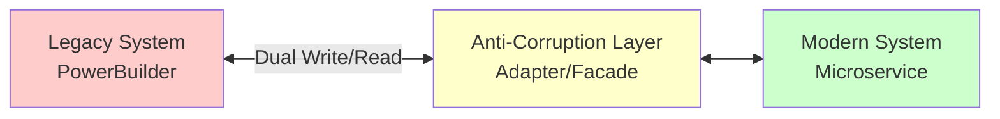

# План управления рисками трансформации "Будущее 2.0"

## Оглавление
1. [Стратегия управления рисками](#1-стратегия-управления-рисками)
2. [Меры по снижению критических рисков](#2-меры-по-снижению-критических-рисков)
3. [Меры по снижению высоких рисков](#3-меры-по-снижению-высоких-рисков)
4. [Меры по снижению средних рисков](#4-меры-по-снижению-средних-рисков)
5. [Мониторинг и контроль рисков](#5-мониторинг-и-контроль-рисков)
6. [Планы реагирования на инциденты](#6-планы-реагирования-на-инциденты)

---

## 1. Стратегия управления рисками

### Принципы управления
1. **Проактивность**: Предотвращение рисков, а не реагирование на них
2. **Прозрачность**: Открытое обсуждение рисков на всех уровнях
3. **Ответственность**: Назначение владельцев для каждого риска
4. **Измеримость**: Количественная оценка рисков и эффективности мер
5. **Итеративность**: Регулярный пересмотр и обновление рисков

### Роли и ответственность

| Роль | Ответственность |
|------|----------------|
| **Спонсор проекта** | Утверждение бюджета на меры по снижению рисков |
| **Архитектор** | Технические меры по снижению архитектурных рисков |
| **Руководитель проекта** | Координация мер, мониторинг рисков |
| **Владелец риска** | Реализация мер по конкретному риску |
| **Команда безопасности** | Меры по информационной безопасности |
| **Юридический отдел** | Соответствие регуляторным требованиям |

---

## 2. Меры по снижению критических рисков

### R01: Потеря данных при миграции из DWH

#### Технические меры (Приоритет: Высокий)

**1. Многоэтапная миграция с валидацией**
- **Описание**: Миграция данных в несколько этапов с проверкой на каждом
- **Ответственный**: Data Engineer Lead
- **Срок**: 6 месяцев
- **Метрики**: 100% соответствие контрольных сумм

**Этапы:**
```
1. Анализ и профилирование данных
   - Оценка объема и качества данных
   - Выявление проблемных областей
   - Создание data dictionary

2. Пилотная миграция
   - Миграция 1% данных
   - Валидация результатов
   - Корректировка процесса

3. Поэтапная миграция
   - Миграция по доменам
   - Параллельная работа старой и новой систем
   - Сверка данных после каждого этапа

4. Финальная синхронизация
   - Миграция дельты
   - Финальная валидация
   - Переключение на новую систему
```

**2. Автоматизированная валидация данных**
- **Инструменты**: Great Expectations, custom scripts
- **Проверки**:
  - Количество записей (row count)
  - Контрольные суммы (checksums)
  - Бизнес-правила (business rules)
  - Референциальная целостность (referential integrity)
- **Частота**: После каждого этапа миграции

**3. Резервное копирование**
- **Стратегия**: 3-2-1 (3 копии, 2 носителя, 1 offsite)
- **Инструменты**: Veeam, Yandex Cloud Backup
- **RPO**: 1 час
- **RTO**: 4 часа
- **Хранение**: 7 лет (требование регуляторов)

#### Управленческие меры (Приоритет: Высокий)

**1. Создание команды миграции**
- **Состав**:
  - Data Engineer
  - DBA
  - QA Engineer
  - Business Analyst

**2. Страхование данных**
- **Покрытие**: До 100 млн ₽
- **Страховщик**: Крупная страховая компания

**3. План отката (Rollback Plan)**
```
Триггеры отката:
- Потеря > 0.1% данных
- Критические ошибки валидации
- Недоступность системы > 4 часов

Процедура отката:
1. Остановка миграции (15 мин)
2. Восстановление из backup (2 часа)
3. Переключение на старую систему (30 мин)
4. Анализ причин (1 день)
5. Корректировка плана (3 дня)
```

---

### R02: Несовместимость легаси-систем с новой архитектурой

#### Технические меры (Приоритет: Высокий)

**1. Антикоррупционный слой (Anti-Corruption Layer)**
- **Паттерн**: Adapter + Facade
- **Технологии**: Spring Boot, gRPC
- **Функции**:
  - Трансляция протоколов (PowerBuilder ↔ REST/gRPC)
  - Преобразование форматов данных
  - Кэширование запросов
  - Обработка ошибок



**2. Strangler Fig Pattern**
- **Подход**: Постепенная замена функциональности
- **Этапы**:
  1. Идентификация границ (bounded contexts)
  2. Создание новых сервисов
  3. Перенаправление трафика
  4. Вывод из эксплуатации старых компонентов

**3. Двойная запись (Dual Write)**
- **Период**: 6-12 месяцев
- **Механизм**: Запись в обе системы параллельно
- **Валидация**: Сравнение результатов
- **Откат**: Возврат к старой системе при проблемах

#### Управленческие меры (Приоритет: Средний)

**1. Аудит легаси-систем**
- **Срок**: 2 месяца
- **Результат**: Документация всей бизнес-логики
- **Инструменты**: Reverse engineering tools

**2. Пилотный проект**
- **Домен**: Запись на прием (низкий риск)
- **Срок**: 3 месяца
- **Цель**: Проверка подхода к интеграции
- **Критерии успеха**:
  - Функциональная эквивалентность
  - Производительность не хуже легаси
  - Отсутствие критических ошибок

---

### R03: Недостаточная производительность событийной шины

#### Технические меры (Приоритет: Высокий)

**1. Capacity Planning**
- **Инструменты**: Kafka sizing calculator, load testing
- **Параметры**:
  - Throughput: 100,000 events/sec (пик)
  - Retention: 7 дней
  - Replication factor: 3
  - Partitions: 100 per topic

**Расчет ресурсов:**
```
Текущая нагрузка: 10,000 events/sec
Рост (3 года): 10x
Пиковая нагрузка: 100,000 events/sec
Запас: 2x
Целевая capacity: 200,000 events/sec

Конфигурация Kafka:
- Brokers: 9 (3 per AZ)
- Instance type: c5.4xlarge
- Storage: 10 TB NVMe SSD per broker
- Network: 10 Gbps
```

**2. Оптимизация производительности**
- **Compression**: LZ4 (баланс скорость/размер)
- **Batching**: 100 KB или 10 ms
- **Acks**: acks=1 (баланс надежность/скорость)
- **Partitioning strategy**: По ключу домена

**3. Мониторинг и алертинг**
```yaml
Метрики:
  - kafka_broker_messages_in_per_sec
  - kafka_consumer_lag
  - kafka_request_latency_ms
  - kafka_disk_usage_percent

Алерты:
  - Consumer lag > 10,000: WARNING
  - Consumer lag > 100,000: CRITICAL
  - Latency > 100ms: WARNING
  - Latency > 500ms: CRITICAL
  - Disk usage > 80%: WARNING
```

#### Управленческие меры (Приоритет: Средний)

**1. Нагрузочное тестирование**
- **Инструменты**: JMeter, Gatling, custom scripts
- **Сценарии**:
  - Нормальная нагрузка (baseline)
  - Пиковая нагрузка (10x)
  - Стресс-тест (до отказа)
  - Soak test (длительная нагрузка)
- **Частота**: Ежемесячно

**2. Резервный план**
- **Вариант A**: Горизонтальное масштабирование Kafka
- **Вариант B**: Переход на Pulsar (более производительный)
- **Вариант C**: Гибридная архитектура (Kafka + RabbitMQ)

---

### R04: Нарушение требований регуляторов

#### Технические меры (Приоритет: Критический)

**1. Compliance by Design**
- **Принцип**: Встраивание требований в архитектуру
- **Требования**:
  - **ФЗ-152 (ПДн)**: Шифрование, аудит, согласие
  - **ЦБ РФ**: Отчетность, хранение данных 5 лет
  - **Минздрав**: Медицинская тайна, ЕГИСЗ
  - **GDPR**: Right to be forgotten, data portability

**2. Технические меры по ФЗ-152**
```
Шифрование:
- At rest: AES-256
- In transit: TLS 1.3
- Key management: Yandex KMS

Аудит:
- Все операции с ПДн логируются
- Хранение логов: 3 года
- Инструменты: ELK Stack, Splunk

Контроль доступа:
- RBAC + ABAC
- MFA для критичных операций
- Регулярный пересмотр прав
```

**3. Сертификация систем**
- **ФСТЭК**: Сертификация средств защиты информации
- **ФСБ**: Лицензия на криптографию
- **Минздрав**: Соответствие требованиям ЕГИСЗ
- **Срок**: 12 месяцев

#### Управленческие меры (Приоритет: Критический)

**1. Создание Compliance Office**
- **Состав**:
  - Compliance Officer
  - Юрист
  - Специалист по ИБ
- **Функции**:
  - Мониторинг изменений законодательства
  - Аудит соответствия
  - Обучение персонала

**2. Регулярные аудиты**
- **Внутренний аудит**: Ежеквартально
- **Внешний аудит**: Ежегодно
- **Пентест**: Раз в полгода

**3. Страхование ответственности**
- **Покрытие**: До 500 млн ₽
- **Риски**: Штрафы, судебные издержки
- **Стоимость**: 2 млн ₽/год

---

### R05: Утечка персональных данных

#### Технические меры (Приоритет: Критический)

**1. Defense in Depth**
```
Уровень 1: Периметр
- WAF (Web Application Firewall)
- DDoS protection
- IDS/IPS

Уровень 2: Сеть
- Network segmentation
- Zero Trust Network
- VPN для удаленного доступа

Уровень 3: Приложение
- Input validation
- Output encoding
- OWASP Top 10 mitigation

Уровень 4: Данные
- Encryption at rest
- Encryption in transit
- Data masking/tokenization

Уровень 5: Мониторинг
- SIEM (Security Information and Event Management)
- User Behavior Analytics
- Threat Intelligence
```

**2. Data Loss Prevention (DLP)**
- **Инструменты**: Symantec DLP, Microsoft Purview
- **Политики**:
  - Блокировка передачи ПДн по email
  - Контроль копирования на USB
  - Мониторинг печати документов

**3. Минимизация данных**
- **Принцип**: Хранить только необходимые данные
- **Меры**:
  - Псевдонимизация (вместо ФИО - ID)
  - Агрегация (вместо детальных данных - статистика)
  - Автоматическое удаление (после истечения срока)

#### Управленческие меры (Приоритет: Критический)

**1. Security Awareness Training**
- **Частота**: Ежеквартально
- **Темы**:
  - Фишинг и социальная инженерия
  - Безопасность паролей
  - Работа с ПДн
  - Инциденты безопасности
- **Формат**: Онлайн-курсы + тесты

**2. Incident Response Plan**
```
Фазы реагирования:
1. Обнаружение (Detection)
   - Автоматические алерты
   - Сообщения пользователей
   - Время: < 1 час

2. Сдерживание (Containment)
   - Изоляция скомпрометированных систем
   - Блокировка учетных записей
   - Время: < 4 часа

3. Ликвидация (Eradication)
   - Удаление вредоносного ПО
   - Закрытие уязвимостей
   - Время: < 24 часа

4. Восстановление (Recovery)
   - Восстановление из backup
   - Возврат к нормальной работе
   - Время: < 48 часов

5. Извлечение уроков (Lessons Learned)
   - Анализ инцидента
   - Обновление процедур
   - Время: 1 неделя
```

**3. Bug Bounty Program**
- **Платформа**: HackerOne, Bugcrowd
- **Награды**: От 10 тыс до 1 млн ₽
- **Scope**: Все публичные системы

---

## 3. Меры по снижению высоких рисков

### R06: Сопротивление изменениям со стороны персонала

#### Управленческие меры (Приоритет: Высокий)

**1. Change Management Program**
- **Модель**: ADKAR (Awareness, Desire, Knowledge, Ability, Reinforcement)
- **Этапы**:
  1. **Awareness** (Осведомленность)
     - Презентации для всех сотрудников
     - Объяснение причин изменений
     - Демонстрация выгод

  2. **Desire** (Желание)
     - Вовлечение в процесс проектирования
     - Сбор обратной связи
     - Программа амбассадоров

  3. **Knowledge** (Знания)
     - Обучающие программы
     - Документация и видео-уроки
     - Sandbox для практики

  4. **Ability** (Способность)
     - Практические тренинги
     - Поддержка на рабочем месте
     - Горячая линия

  5. **Reinforcement** (Закрепление)
     - Поощрение использования новых систем
     - Регулярные опросы удовлетворенности
     - Continuous improvement

**2. Программа обучения**
- **Целевые группы**:
  - Врачи: Новый интерфейс, AI-диагностика
  - Операторы: Регистрация, работа с данными
  - Аналитики: Data Portal, BI инструменты
- **Формат**: Очно + онлайн, практические занятия

**3. Система мотивации**
- **KPI**: Использование новых систем
- **Бонусы**: До 20% от оклада
- **Геймификация**: Рейтинги, достижения

#### Технические меры (Приоритет: Средний)

**1. User-Friendly интерфейсы**
- **Принципы**: Material Design, доступность
- **UX исследования**: Тестирование с реальными пользователями
- **Итеративный дизайн**: A/B тестирование

**2. Постепенный переход**
- **Hybrid mode**: Параллельная работа старой и новой систем
- **Срок**: 6 месяцев
- **Поддержка**: 24/7 горячая линия

---

### R07: Недостаток компетенций в новых технологиях

#### Управленческие меры (Приоритет: Высокий)

**1. Программа развития компетенций**
- **Направления**:
  - Cloud Native (Kubernetes, Docker) - Сертификация: CKA, CKAD
  - Event-Driven Architecture (Kafka, Flink) - Сертификация: Confluent Certified
  - Data Engineering (Spark, Airflow, dbt) - Сертификация: Databricks Certified
  - Microservices (Go, gRPC, Service Mesh)
- **Целевые группы**: DevOps, Backend, Data Engineers

**2. Найм экспертов**
- **Позиции**:
  - Principal Architect
  - Senior Data Engineer
  - Senior DevOps

**3. Привлечение консультантов**
- **Компании**: ThoughtWorks, EPAM, Luxoft
- **Роли**: Архитектурный ревью, code review, менторинг
- **Длительность**: 12 месяцев

#### Технические меры (Приоритет: Средний)

**1. Внутренняя база знаний**
- **Платформа**: Confluence, Notion
- **Контент**:
  - Архитектурные решения (ADR)
  - Runbooks
  - Best practices
  - Troubleshooting guides
- **Ответственный**: Tech Lead каждой команды

**2. Code Review и Pair Programming**
- **Обязательно**: 2 reviewer для каждого PR
- **Pair Programming**: 20% времени
- **Mob Programming**: Раз в неделю для сложных задач

---

### R08: Превышение бюджета трансформации

#### Управленческие меры (Приоритет: Высокий)

**1. Детальное планирование**
- **Статьи расходов**:
  - Инфраструктура (облачные ресурсы, лицензии, оборудование)
  - Персонал (зарплаты, обучение, найм)
  - Консультанты (архитектурный консалтинг, внедрение)
  - Прочее (аудиты, сертификация, страхование)
- **Резерв**: 20% от общего бюджета

**2. Контроль расходов**
- **Частота**: Еженедельно
- **Инструменты**: Jira, Confluence, Excel
- **Метрики**:
  - Burn rate
  - Cost per story point
  - ROI по фазам
- **Алерты**: Превышение плана на 10%

**3. Оптимизация затрат**
- **Cloud Cost Optimization**:
  - Reserved Instances (экономия 30-50%)
  - Spot Instances для dev/test
  - Auto-scaling
  - Rightsizing

#### Технические меры (Приоритет: Средний)

**1. FinOps практики**
- **Инструменты**: CloudHealth, Kubecost
- **Метрики**:
  - Cost per service
  - Cost per customer
  - Waste (неиспользуемые ресурсы)
- **Цель**: Снижение затрат на 20%

---

### R09: Задержка сроков миграции

#### Управленческие меры (Приоритет: Высокий)

**1. Agile/Scrum методология**
- **Спринты**: 2 недели
- **Церемонии**:
  - Daily standup (15 мин)
  - Sprint planning (4 часа)
  - Sprint review (2 часа)
  - Retrospective (1.5 часа)
- **Метрики**:
  - Velocity
  - Burndown chart
  - Cycle time

**2. Roadmap с вехами**
```
Трансформация (36 месяцев):
├─ M1: Выбор технологий (1 мес)
├─ M2: Пилот в 1 домене (3 мес)
├─ M3: Оценка результатов (2 мес)
├─ M4: Миграция 3 доменов (6 мес)
├─ M5: Событийная шина (3 мес)
├─ M6: Витрина данных v1 (3 мес)
├─ M7: Миграция всех доменов (12 мес)
├─ M8: Вывод легаси (3 мес)
└─ M9: Оптимизация (3 мес)
```

**3. Risk-based planning**
- **Приоритет**: Сначала высокорисковые задачи
- **Буферы**: 20% времени на непредвиденное
- **Параллелизация**: Независимые задачи параллельно

#### Технические меры (Приоритет: Средний)

**1. CI/CD автоматизация**
- **Цель**: Сокращение времени релиза
- **Инструменты**: GitLab CI, ArgoCD
- **Метрики**:
  - Deployment frequency: Daily
  - Lead time: < 1 день
  - MTTR: < 1 час

**2. Infrastructure as Code**
- **Инструменты**: Terraform, Ansible
- **Преимущества**:
  - Быстрое развертывание окружений
  - Воспроизводимость
  - Версионирование инфраструктуры

---

### R10: Проблемы интеграции с внешними системами

#### Технические меры (Приоритет: Высокий)

**1. API Gateway паттерн**
- **Инструменты**: Kong, Apigee
- **Функции**:
  - Rate limiting
  - Authentication/Authorization
  - Protocol translation
  - Circuit breaker
  - Retry logic

**2. Contract Testing**
- **Инструменты**: Pact, Spring Cloud Contract
- **Подход**: Consumer-Driven Contracts
- **Частота**: При каждом изменении API

**3. Мониторинг интеграций**
```yaml
Метрики:
  - api_request_duration_seconds
  - api_request_total
  - api_request_errors_total
  - api_circuit_breaker_state

Алерты:
  - Error rate > 1%: WARNING
  - Error rate > 5%: CRITICAL
  - Latency > 1s: WARNING
  - Circuit breaker OPEN: CRITICAL
```

#### Управленческие меры (Приоритет: Средний)

**1. Партнерские соглашения (SLA)**
- **Параметры**:
  - Availability: 99.9%
  - Response time: < 500ms
  - Support: 24/7
- **Штрафы**: За нарушение SLA

**2. Резервные интеграции**
- **Подход**: Несколько поставщиков для критичных сервисов
- **Пример**: 2 лаборатории вместо 1

---

## 4. Меры по снижению средних рисков

### R11: Недостаточная масштабируемость облачной инфраструктуры

**Вероятность**: Низкая | **Влияние**: Высокое | **Приоритет**: Высокий

#### Технические меры

1. **Автоматическое масштабирование**
   - Настройка Horizontal Pod Autoscaler (HPA) в Kubernetes
   - Vertical Pod Autoscaler для оптимизации ресурсов
   - Cluster Autoscaler для динамического управления нодами

2. **Архитектура для масштабирования**
   - Stateless сервисы для горизонтального масштабирования
   - Использование managed services (RDS, ElastiCache)
   - Распределение нагрузки через Load Balancer

3. **Мониторинг и планирование емкости**
   - Прогнозирование роста нагрузки
   - Capacity planning на основе метрик
   - Нагрузочное тестирование перед масштабированием

#### Управленческие меры

1. **Обучение команды**
   - Тренинги по cloud-native архитектуре
   - Изучение паттернов масштабирования
   - Практика работы с Kubernetes

2. **Процесс планирования**
   - Регулярный анализ метрик производительности
   - Планирование масштабирования заранее
   - Тестирование масштабируемости на ранних этапах

---

### R12: Vendor lock-in при выборе облачного провайдера

**Вероятность**: Средняя | **Влияние**: Среднее | **Приоритет**: Средний

#### Технические меры

1. **Абстракция инфраструктуры**
   - Использование Terraform для Infrastructure as Code
   - Абстрагирование от специфичных сервисов провайдера
   - Применение open-source альтернатив (Kubernetes вместо EKS/AKS)

2. **Портируемая архитектура**
   - Контейнеризация всех сервисов
   - Использование стандартных протоколов и API
   - Избегание проприетарных сервисов где возможно

3. **Multi-cloud готовность**
   - Проектирование с учетом возможной миграции
   - Использование cloud-agnostic инструментов
   - Документирование зависимостей от провайдера

#### Управленческие меры

1. **Стратегия выбора сервисов**
   - Оценка критичности vendor lock-in для каждого сервиса
   - Приоритет open-source решениям
   - Планирование exit-стратегии

2. **Регулярный аудит зависимостей**
   - Ревью используемых облачных сервисов
   - Оценка стоимости миграции
   - Мониторинг появления альтернатив

---

### R13: Сложность отладки распределенных систем

**Вероятность**: Высокая | **Влияние**: Низкое | **Приоритет**: Средний

#### Технические меры

1. **Observability платформа**
   - Внедрение Distributed Tracing (Jaeger/Zipkin)
   - Централизованное логирование (ELK/Loki)
   - Метрики и мониторинг (Prometheus/Grafana)

2. **Correlation ID и контекст**
   - Сквозная трассировка запросов через все сервисы
   - Структурированное логирование с контекстом
   - Визуализация зависимостей между сервисами

3. **Инструменты отладки**
   - Service mesh (Istio/Linkerd) для наблюдаемости
   - Chaos Engineering для тестирования устойчивости
   - Replay механизмы для воспроизведения проблем

#### Управленческие меры

1. **Обучение команды**
   - Тренинги по distributed systems debugging
   - Практика работы с трассировкой
   - Изучение паттернов observability

2. **Runbook и документация**
   - Документирование типовых проблем и решений
   - Чек-листы для диагностики
   - Примеры использования инструментов

---

### R14: Несогласованность данных между доменами

**Вероятность**: Средняя | **Влияние**: Среднее | **Приоритет**: Средний

#### Технические меры

1. **Eventual Consistency паттерны**
   - Saga Pattern для распределенных транзакций
   - Event Sourcing для истории изменений
   - Компенсирующие транзакции при ошибках

2. **Валидация согласованности**
   - Reconciliation процессы для проверки данных
   - Автоматические проверки целостности
   - Алерты при обнаружении несоответствий

3. **Bounded Context изоляция**
   - Четкие границы между доменами
   - Anti-Corruption Layer для защиты доменов
   - Каноническая модель данных для интеграции

#### Управленческие меры

1. **Процесс управления данными**
   - Data governance политики
   - Определение владельцев данных (Data Owners)
   - Регулярный аудит качества данных

2. **Обучение команды**
   - Тренинги по DDD и Bounded Contexts
   - Изучение паттернов eventual consistency
   - Практика работы с распределенными данными

---

## 5. Мониторинг и контроль рисков

### 5.1 Система мониторинга рисков

#### Инструменты мониторинга

1. **Технический мониторинг**
   - **Prometheus + Grafana**: метрики производительности и доступности
   - **ELK Stack**: анализ логов и выявление аномалий
   - **Jaeger**: трассировка распределенных транзакций
   - **Sentry**: отслеживание ошибок в приложениях

2. **Бизнес-мониторинг**
   - **Дашборды KPI**: отслеживание ключевых метрик проекта
   - **Burndown charts**: прогресс выполнения задач
   - **Velocity tracking**: скорость разработки команды

3. **Мониторинг безопасности**
   - **SIEM-система**: анализ событий безопасности
   - **Vulnerability scanning**: регулярное сканирование уязвимостей
   - **Audit logs**: журналирование критических операций

#### Ключевые метрики для отслеживания

| Категория | Метрика | Целевое значение | Критический порог |
|-----------|---------|------------------|-------------------|
| **Производительность** | Latency событий | < 100ms (p95) | > 500ms |
| | Throughput Kafka | > 100k msg/sec | < 50k msg/sec |
| | Query time ClickHouse | < 1s (p95) | > 5s |
| **Надежность** | Uptime сервисов | > 99.9% | < 99.5% |
| | Error rate | < 0.1% | > 1% |
| | Data loss | 0 | > 0 |
| **Безопасность** | Failed auth attempts | < 10/hour | > 100/hour |
| | Vulnerability count | 0 critical | > 0 critical |
| | Compliance violations | 0 | > 0 |
| **Проект** | Sprint velocity | ±10% от плана | ±30% от плана |
| | Budget variance | ±5% | ±15% |
| | Schedule variance | ±1 week | ±1 month |

### 5.2 Процесс контроля рисков

#### Регулярные активности

1. **Ежедневный мониторинг**
   - Проверка дашбордов технических метрик
   - Анализ алертов и инцидентов
   - Быстрое реагирование на критические проблемы

2. **Еженедельный обзор**
   - Встреча команды по рискам (30 минут)
   - Обзор статуса известных рисков
   - Выявление новых потенциальных рисков
   - Оценка эффективности мер по снижению

3. **Ежемесячный анализ**
   - Детальный анализ трендов метрик
   - Обновление матрицы рисков
   - Корректировка планов митигации
   - Отчет для стейкхолдеров

4. **Квартальный аудит**
   - Комплексная оценка состояния проекта
   - Ревью архитектурных решений
   - Аудит безопасности
   - Стратегическое планирование

#### Эскалация рисков

**Уровень 1: Команда разработки**
- Риски с низким приоритетом
- Технические проблемы в рамках компетенции команды
- Решение: в течение спринта

**Уровень 2: Tech Lead / Архитектор**
- Риски со средним приоритетом
- Архитектурные решения
- Решение: в течение 1-2 недель

**Уровень 3: Project Manager**
- Риски с высоким приоритетом
- Проблемы с ресурсами или сроками
- Решение: в течение недели

**Уровень 4: Steering Committee**
- Критические риски
- Стратегические решения
- Решение: немедленно (в течение 24-48 часов)

### 5.3 Отчетность по рискам

#### Еженедельный статус-отчет

**Формат**: Email + Dashboard

**Содержание**:
- Топ-5 активных рисков
- Новые выявленные риски
- Закрытые риски
- Ключевые метрики (красный/желтый/зеленый статус)
- Требуемые действия

#### Ежемесячный отчет для стейкхолдеров

**Формат**: Презентация + Документ

**Содержание**:
- Executive summary
- Обновленная матрица рисков
- Тренды ключевых метрик
- Выполненные меры по снижению рисков
- Планы на следующий месяц
- Запросы на ресурсы/решения

---

## 6. Планы реагирования на инциденты

### 6.1 Классификация инцидентов

#### Severity Levels

**P1 - Критический**
- Полная недоступность системы
- Массовая потеря данных
- Критическая уязвимость безопасности
- **SLA**: Реагирование в течение 15 минут, решение в течение 4 часов

**P2 - Высокий**
- Частичная недоступность системы
- Значительное снижение производительности
- Проблемы с критическими функциями
- **SLA**: Реагирование в течение 1 часа, решение в течение 24 часов

**P3 - Средний**
- Проблемы с некритическими функциями
- Умеренное снижение производительности
- Ошибки, не влияющие на основной функционал
- **SLA**: Реагирование в течение 4 часов, решение в течение 72 часов

**P4 - Низкий**
- Косметические проблемы
- Незначительные неудобства
- Запросы на улучшения
- **SLA**: Реагирование в течение 24 часов, решение по планированию

### 6.2 Процесс реагирования на инциденты

#### Фаза 1: Обнаружение и оповещение

1. **Автоматическое обнаружение**
   - Алерты из систем мониторинга
   - Автоматическое создание тикета в системе инцидентов
   - Оповещение дежурной команды (PagerDuty/Opsgenie)

2. **Ручное обнаружение**
   - Сообщения от пользователей
   - Выявление в процессе мониторинга
   - Создание тикета вручную

#### Фаза 2: Первичная оценка

1. **Определение severity**
   - Оценка влияния на бизнес
   - Количество затронутых пользователей
   - Присвоение приоритета

2. **Назначение ответственных**
   - Incident Commander (для P1-P2)
   - Техническая команда реагирования
   - Коммуникационный менеджер (для P1)

#### Фаза 3: Диагностика

1. **Сбор информации**
   - Анализ логов и метрик
   - Проверка последних изменений
   - Трассировка проблемных запросов

2. **Формирование гипотез**
   - Определение возможных причин
   - Приоритизация гипотез
   - Планирование проверок

#### Фаза 4: Устранение

1. **Временное решение (Workaround)**
   - Быстрое восстановление работоспособности
   - Rollback изменений при необходимости
   - Переключение на резервные системы

2. **Постоянное решение**
   - Устранение корневой причины
   - Тестирование исправления
   - Развертывание в production

#### Фаза 5: Восстановление

1. **Проверка работоспособности**
   - Валидация метрик
   - Проверка функциональности
   - Подтверждение от пользователей

2. **Мониторинг стабильности**
   - Усиленный мониторинг в течение 24-48 часов
   - Готовность к быстрому реагированию
   - Отслеживание повторных проявлений

#### Фаза 6: Post-Mortem

1. **Анализ инцидента**
   - Хронология событий
   - Корневая причина (Root Cause Analysis)
   - Что сработало хорошо / что можно улучшить

2. **Action Items**
   - Меры по предотвращению повторения
   - Улучшения процессов
   - Обновление документации и runbook'ов

### 6.3 Коммуникационный план

#### Внутренняя коммуникация

**Каналы**:
- Slack канал #incidents для оперативной коммуникации
- Confluence страница для документирования
- Email для формальных уведомлений

**Частота обновлений**:
- **P1**: Каждые 30 минут
- **P2**: Каждые 2 часа
- **P3**: Ежедневно
- **P4**: По завершении

#### Внешняя коммуникация

**Стейкхолдеры**:
- Бизнес-заказчики
- Конечные пользователи
- Регуляторы (при необходимости)

**Шаблон сообщения**:
```
Тема: [P1/P2/P3] Инцидент: [Краткое описание]

Статус: Обнаружен / В работе / Решен

Описание:
- Что произошло
- Какие системы затронуты
- Влияние на пользователей

Действия:
- Что делается для решения
- Ожидаемое время восстановления

Следующее обновление: [Время]
```

### 6.4 Обучение и готовность

#### Регулярные активности

1. **Game Days** (ежеквартально)
   - Симуляция инцидентов
   - Тестирование планов реагирования
   - Обучение команды

2. **Chaos Engineering** (ежемесячно)
   - Контролируемое внесение сбоев
   - Проверка устойчивости системы
   - Выявление слабых мест

3. **Обновление Runbook'ов** (постоянно)
   - Документирование новых сценариев
   - Обновление на основе Post-Mortem
   - Ревью и валидация процедур

4. **Тренинги команды** (ежеквартально)
   - Обучение новых членов команды
   - Освежение знаний для опытных
   - Практические упражнения

---

## Заключение

Эффективное управление рисками требует:

1. **Проактивного подхода**: предотвращение рисков лучше, чем их устранение
2. **Непрерывного мониторинга**: раннее обнаружение проблем критично
3. **Быстрого реагирования**: четкие планы действий сокращают время восстановления
4. **Обучения на ошибках**: Post-Mortem анализ помогает избежать повторения
5. **Командной работы**: эффективная коммуникация и координация ключевы для успеха

Регулярный пересмотр и обновление этих планов обеспечит готовность к любым вызовам в процессе трансформации архитектуры.
