# Агрегаты системы "Будущее 2.0"

## 1. Medical Context

### 1.1 Patient Aggregate

**Aggregate Root:** `Patient`

#### Границы агрегата
**Включает:**
- Patient (root entity)
- ContactInfo (value object)
- InsuranceInfo (value object)
- EmergencyContact (value object)
- PatientPreferences (value object)

**НЕ включает:**
- Медицинские записи (отдельный агрегат)
- Записи на приём (отдельный агрегат)
- Финансовую информацию (другой bounded context)

#### Ключи
- **Aggregate ID:** `PatientId` (UUID)
- **Business Key:** `MedicalRecordNumber` (уникальный номер медицинской карты)
- **External Keys:** `PassportNumber`, `InsurancePolicyNumber`

#### Инварианты
1. **Уникальность пациента:** Один пациент = один MedicalRecordNumber
2. **Обязательные данные:** ФИО, дата рождения, контактный телефон обязательны
3. **Возрастные ограничения:** Возраст пациента >= 0 и <= 150 лет
4. **Валидность контактов:** Email должен быть валидным, телефон в формате +7XXXXXXXXXX
5. **Согласие на обработку данных:** Обязательно для регистрации
6. **Статус активности:** Пациент может быть Active, Inactive, Deceased

#### Команды
- `RegisterPatient` - регистрация нового пациента
- `UpdatePatientInfo` - обновление личных данных
- `UpdateContactInfo` - обновление контактной информации
- `UpdateInsuranceInfo` - обновление страховой информации
- `DeactivatePatient` - деактивация пациента
- `MarkPatientDeceased` - отметка о смерти пациента

#### События
- `PatientRegistered`
- `PatientInfoUpdated`
- `PatientContactUpdated`
- `PatientInsuranceUpdated`
- `PatientDeactivated`
- `PatientMarkedDeceased`

#### Жизненный цикл

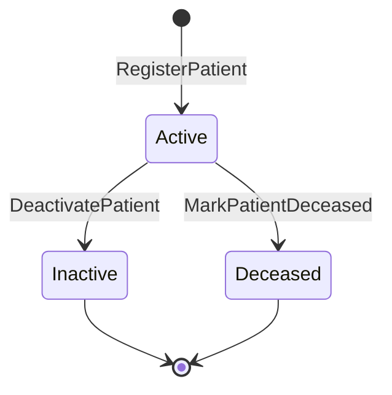

---

### 1.2 Appointment Aggregate

**Aggregate Root:** `Appointment`

#### Границы агрегата
**Включает:**
- Appointment (root entity)
- AppointmentSlot (value object)
- AppointmentReason (value object)
- AppointmentNotes (value object)

**НЕ включает:**
- Полную информацию о пациенте (только PatientId)
- Полную информацию о враче (только DoctorId)
- Медицинские записи (создаются после приёма)
- Счета (создаются в Fintech Context)

#### Ключи
- **Aggregate ID:** `AppointmentId` (UUID)
- **Foreign Keys:** `PatientId`, `DoctorId`, `FacilityId`
- **Business Key:** Комбинация (DoctorId, StartTime) - уникальна

#### Инварианты
1. **Временные ограничения:** StartTime < EndTime
2. **Длительность:** Минимум 15 минут, максимум 4 часа
3. **Будущее время:** StartTime >= CurrentTime (для новых записей)
4. **Рабочее время:** Запись только в рабочие часы клиники (8:00-20:00)
5. **Отсутствие конфликтов:** Один врач не может иметь пересекающиеся записи
6. **Статусы:** Scheduled → Confirmed → InProgress → Completed / Cancelled / NoShow
7. **Отмена:** Можно отменить только Scheduled или Confirmed записи
8. **Время отмены:** Отмена минимум за 2 часа до приёма

#### Команды
- `ScheduleAppointment` - создание записи
- `ConfirmAppointment` - подтверждение записи
- `RescheduleAppointment` - перенос записи
- `CancelAppointment` - отмена записи
- `StartAppointment` - начало приёма
- `CompleteAppointment` - завершение приёма
- `MarkNoShow` - отметка о неявке

#### События
- `AppointmentScheduled`
- `AppointmentConfirmed`
- `AppointmentRescheduled`
- `AppointmentCancelled`
- `AppointmentStarted`
- `AppointmentCompleted`
- `AppointmentNoShow`

#### Жизненный цикл

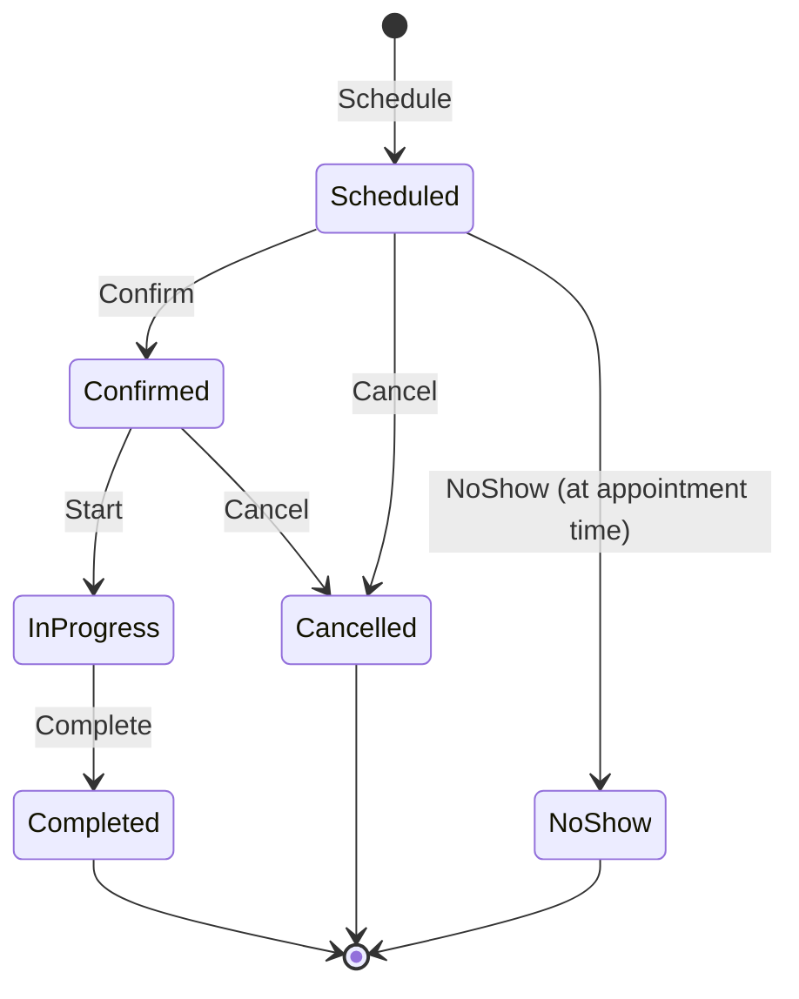

---

### 1.3 Medical Record Aggregate

**Aggregate Root:** `MedicalRecord`

#### Границы агрегата
**Включает:**
- MedicalRecord (root entity)
- Diagnosis (entity collection)
- Prescription (entity collection)
- VitalSigns (value object)
- TreatmentPlan (value object)
- ClinicalNotes (value object)

**НЕ включает:**
- Медицинские изображения (отдельный агрегат)
- Лабораторные анализы (отдельный агрегат)
- Информацию о пациенте (только PatientId)
- Информацию о враче (только DoctorId)

#### Ключи
- **Aggregate ID:** `MedicalRecordId` (UUID)
- **Foreign Keys:** `PatientId`, `DoctorId`, `AppointmentId`
- **Business Key:** Связь с AppointmentId (один приём = одна запись)

#### Инварианты
1. **Обязательные данные:** PatientId, DoctorId, RecordDate обязательны
2. **Временная последовательность:** RecordDate <= CurrentDate
3. **Диагноз:** Минимум один диагноз обязателен для завершённой записи
4. **Жизненные показатели:** Если указаны, должны быть в допустимых диапазонах
   - Температура: 35.0-42.0°C
   - Пульс: 40-200 уд/мин
   - Давление: 60/40 - 250/150 мм рт.ст.
5. **Рецепты:** Каждый рецепт должен иметь название препарата, дозировку, длительность
6. **Неизменяемость:** После подписи врачом запись становится immutable
7. **Конфиденциальность:** Уровень доступа (Public, Confidential, Restricted)

#### Команды
- `CreateMedicalRecord` - создание записи
- `AddDiagnosis` - добавление диагноза
- `AddPrescription` - добавление рецепта
- `UpdateVitalSigns` - обновление жизненных показателей
- `UpdateTreatmentPlan` - обновление плана лечения
- `AddClinicalNotes` - добавление клинических заметок
- `SignRecord` - подпись записи врачом (финализация)

#### События
- `MedicalRecordCreated`
- `DiagnosisAdded`
- `PrescriptionAdded`
- `VitalSignsRecorded`
- `TreatmentPlanUpdated`
- `ClinicalNotesAdded`
- `MedicalRecordSigned`

#### Жизненный цикл

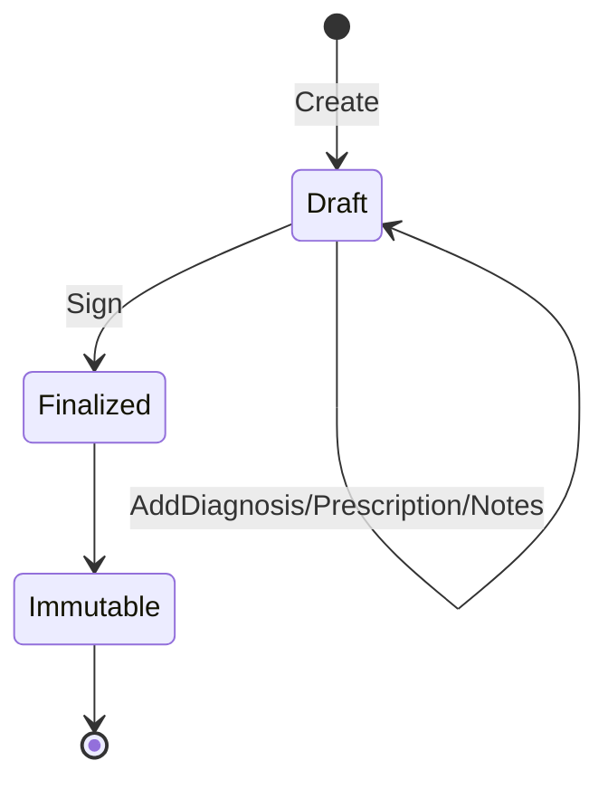

---

### 1.4 Medical Image Aggregate

**Aggregate Root:** `MedicalImage`

#### Границы агрегата
**Включает:**
- MedicalImage (root entity)
- ImageMetadata (value object)
- ImageFile (value object - ссылка на blob storage)
- ImageAnnotations (entity collection)
- DICOMTags (value object)

**НЕ включает:**
- AI анализ (отдельный агрегат в AI Context)
- Медицинскую запись (только MedicalRecordId)
- Сам файл изображения (хранится в blob storage)

#### Ключи
- **Aggregate ID:** `MedicalImageId` (UUID)
- **Foreign Keys:** `PatientId`, `MedicalRecordId`, `StudyId`
- **Business Key:** `DICOMStudyInstanceUID` (для DICOM изображений)
- **Storage Key:** `BlobStorageUrl`

#### Инварианты
1. **Обязательные метаданные:** PatientId, ImageType, CaptureDate обязательны
2. **Формат файла:** Поддерживаемые форматы: DICOM, PNG, JPEG, TIFF
3. **Размер файла:** Максимум 500 MB на изображение
4. **Временная последовательность:** CaptureDate <= CurrentDate
5. **Типы изображений:** X-Ray, CT, MRI, Ultrasound, Photo
6. **Статус обработки:** Uploaded → Processing → Processed / Failed
7. **Конфиденциальность:** Все изображения имеют уровень Confidential
8. **Целостность:** Hash файла для проверки целостности

#### Команды
- `UploadMedicalImage` - загрузка изображения
- `UpdateImageMetadata` - обновление метаданных
- `AddAnnotation` - добавление аннотации
- `RequestAIAnalysis` - запрос AI анализа
- `ArchiveImage` - архивирование изображения
- `DeleteImage` - удаление изображения (с аудитом)

#### События
- `MedicalImageUploaded`
- `ImageMetadataUpdated`
- `ImageAnnotationAdded`
- `AIAnalysisRequested`
- `ImageProcessingCompleted`
- `ImageProcessingFailed`
- `ImageArchived`
- `ImageDeleted`

#### Жизненный цикл

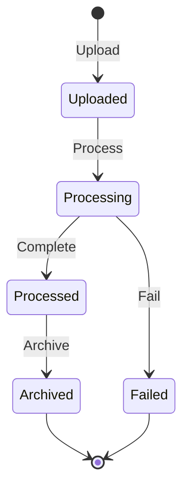

---

## 2. Fintech Context

### 2.1 Payment Aggregate

**Aggregate Root:** `Payment`

#### Границы агрегата
**Включает:**
- Payment (root entity)
- PaymentMethod (value object)
- PaymentDetails (value object)
- TransactionInfo (value object)
- RefundInfo (value object - если есть)

**НЕ включает:**
- Счёт (Invoice) - отдельный агрегат
- Информацию о пациенте (только PatientId)
- Банковские реквизиты (только токены)

#### Ключи
- **Aggregate ID:** `PaymentId` (UUID)
- **Foreign Keys:** `InvoiceId`, `PatientId`
- **Business Key:** `TransactionId` (от платёжного провайдера)
- **Idempotency Key:** Для предотвращения дублирования платежей

#### Инварианты
1. **Положительная сумма:** Amount > 0
2. **Валюта:** Только RUB (₽)
3. **Соответствие счёту:** Amount <= Invoice.TotalAmount
4. **Статусы:** Pending → Processing → Completed / Failed / Cancelled
5. **Неизменяемость:** Completed платежи нельзя изменить
6. **Возврат:** Можно вернуть только Completed платежи
7. **Сумма возврата:** RefundAmount <= Payment.Amount
8. **Временные ограничения:** Возврат возможен в течение 180 дней
9. **Методы оплаты:** Card, BankTransfer, Cash, Insurance
10. **Идемпотентность:** Один IdempotencyKey = один платёж

#### Команды
- `InitiatePayment` - инициация платежа
- `ProcessPayment` - обработка платежа
- `CompletePayment` - завершение платежа
- `FailPayment` - отметка о неудаче
- `CancelPayment` - отмена платежа
- `InitiateRefund` - инициация возврата
- `CompleteRefund` - завершение возврата

#### События
- `PaymentInitiated`
- `PaymentProcessing`
- `PaymentCompleted`
- `PaymentFailed`
- `PaymentCancelled`
- `RefundInitiated`
- `RefundCompleted`
- `RefundFailed`

#### Жизненный цикл

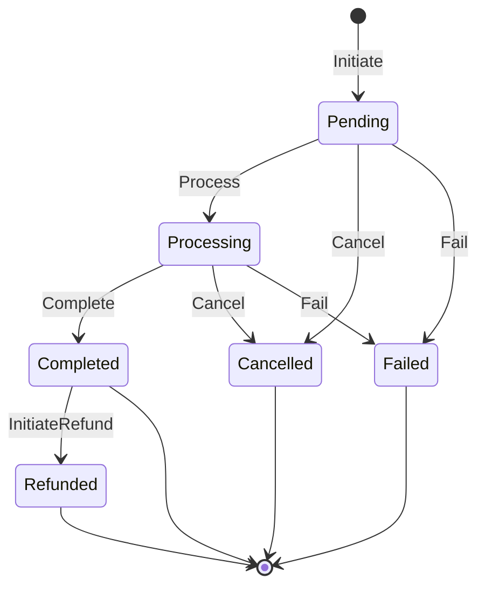

---

### 2.2 Invoice Aggregate

**Aggregate Root:** `Invoice`

#### Границы агрегата
**Включает:**
- Invoice (root entity)
- InvoiceLineItem (entity collection)
- InvoiceDiscount (value object)
- TaxInfo (value object)
- PaymentTerms (value object)

**НЕ включает:**
- Платежи (отдельный агрегат)
- Медицинские услуги (только ссылки)
- Информацию о пациенте (только PatientId)

#### Ключи
- **Aggregate ID:** `InvoiceId` (UUID)
- **Foreign Keys:** `PatientId`, `AppointmentId`
- **Business Key:** `InvoiceNumber` (уникальный номер счёта)

#### Инварианты
1. **Номер счёта:** Уникальный, формат: INV-YYYY-NNNNNN
2. **Позиции счёта:** Минимум одна позиция обязательна
3. **Суммы:**
   - LineItem.Amount = Quantity × UnitPrice
   - Subtotal = Σ(LineItem.Amount)
   - TaxAmount = Subtotal × TaxRate
   - TotalAmount = Subtotal + TaxAmount - DiscountAmount
4. **Положительные значения:** Все суммы >= 0
5. **Статусы:** Draft → Issued → PartiallyPaid → Paid / Cancelled / Overdue
6. **Дата выставления:** IssueDate <= CurrentDate
7. **Срок оплаты:** DueDate >= IssueDate
8. **Изменяемость:** Только Draft счета можно изменять
9. **Отмена:** Можно отменить только Draft или Issued счета

#### Команды
- `CreateInvoice` - создание счёта
- `AddLineItem` - добавление позиции
- `RemoveLineItem` - удаление позиции
- `ApplyDiscount` - применение скидки
- `IssueInvoice` - выставление счёта
- `RecordPayment` - регистрация платежа
- `CancelInvoice` - отмена счёта
- `MarkOverdue` - отметка о просрочке

#### События
- `InvoiceCreated`
- `InvoiceLineItemAdded`
- `InvoiceLineItemRemoved`
- `InvoiceDiscountApplied`
- `InvoiceIssued`
- `InvoicePaymentRecorded`
- `InvoiceFullyPaid`
- `InvoiceCancelled`
- `InvoiceOverdue`

#### Жизненный цикл

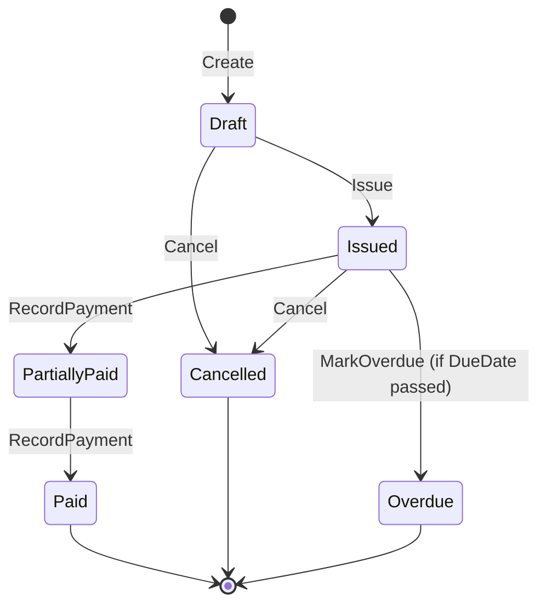

---

### 2.3 Loan Application Aggregate

**Aggregate Root:** `LoanApplication`

#### Границы агрегата
**Включает:**
- LoanApplication (root entity)
- LoanTerms (value object)
- ApplicantInfo (value object)
- CreditScore (value object)
- LoanDecision (value object)
- RepaymentSchedule (entity collection)

**НЕ включает:**
- Платежи по кредиту (отдельный агрегат)
- Полную информацию о пациенте (только PatientId)
- Медицинские данные

#### Ключи
- **Aggregate ID:** `LoanApplicationId` (UUID)
- **Foreign Keys:** `PatientId`, `InvoiceId`
- **Business Key:** `ApplicationNumber` (уникальный номер заявки)

#### Инварианты
1. **Номер заявки:** Уникальный, формат: LOAN-YYYY-NNNNNN
2. **Сумма кредита:**
   - MinAmount: 10,000 ₽
   - MaxAmount: 5,000,000 ₽
   - Amount <= Invoice.TotalAmount
3. **Срок кредита:**
   - MinTerm: 3 месяца
   - MaxTerm: 60 месяцев
4. **Процентная ставка:**
   - MinRate: 5% годовых
   - MaxRate: 30% годовых
5. **Возраст заявителя:** 18-75 лет
6. **Статусы:** Draft → Submitted → UnderReview → Approved / Rejected / Cancelled
7. **Кредитный скоринг:** Обязателен для Submitted заявок
8. **Решение:** Обязательно для Approved/Rejected статусов
9. **График платежей:** Создаётся только для Approved заявок
10. **Неизменяемость:** Approved/Rejected заявки нельзя изменить

#### Команды
- `CreateLoanApplication` - создание заявки
- `UpdateLoanTerms` - обновление условий
- `SubmitApplication` - подача заявки
- `AssignForReview` - назначение на проверку
- `PerformCreditCheck` - проверка кредитной истории
- `ApproveApplication` - одобрение заявки
- `RejectApplication` - отклонение заявки
- `CancelApplication` - отмена заявки
- `GenerateRepaymentSchedule` - генерация графика платежей

#### События
- `LoanApplicationCreated`
- `LoanTermsUpdated`
- `LoanApplicationSubmitted`
- `LoanApplicationAssignedForReview`
- `CreditCheckPerformed`
- `LoanApplicationApproved`
- `LoanApplicationRejected`
- `LoanApplicationCancelled`
- `RepaymentScheduleGenerated`

#### Жизненный цикл

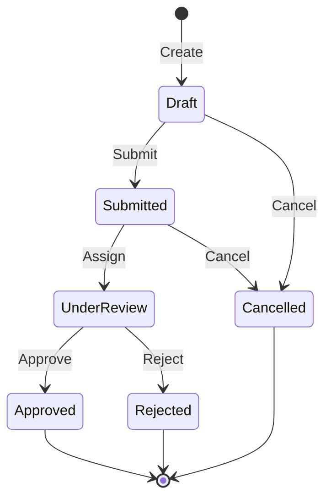

---

## 3. AI Context

### 3.1 AI Analysis Aggregate

**Aggregate Root:** `AIAnalysis`

#### Границы агрегата
**Включает:**
- AIAnalysis (root entity)
- AnalysisRequest (value object)
- AnalysisResult (value object)
- Findings (entity collection)
- ConfidenceScores (value object)
- ModelMetadata (value object)

**НЕ включает:**
- Медицинское изображение (только MedicalImageId)
- AI модель (только ModelId)
- Медицинскую запись (только MedicalRecordId)

#### Ключи
- **Aggregate ID:** `AIAnalysisId` (UUID)
- **Foreign Keys:** `MedicalImageId`, `ModelId`, `PatientId`
- **Business Key:** Комбинация (MedicalImageId, ModelId, RequestTimestamp)

#### Инварианты
1. **Обязательные данные:** MedicalImageId, ModelId, RequestTimestamp обязательны
2. **Статусы:** Requested → Processing → Completed / Failed
3. **Временная последовательность:** RequestTimestamp <= CompletionTimestamp
4. **Время обработки:** Максимум 5 минут для одного анализа
5. **Confidence Score:** Значение от 0.0 до 1.0
6. **Минимальная уверенность:** Результаты с confidence < 0.7 помечаются как "Требуется проверка врача"
7. **Находки:** Каждая находка должна иметь тип, локализацию, confidence
8. **Версия модели:** Обязательна для воспроизводимости результатов
9. **Неизменяемость:** Completed анализы нельзя изменить
10. **Аудит:** Все анализы логируются для регуляторных требований

#### Команды
- `RequestAIAnalysis` - запрос анализа
- `StartProcessing` - начало обработки
- `AddFinding` - добавление находки
- `CompleteAnalysis` - завершение анализа
- `FailAnalysis` - отметка о неудаче
- `RequestHumanReview` - запрос проверки врачом
- `ApproveAnalysis` - одобрение врачом
- `RejectAnalysis` - отклонение врачом

#### События
- `AIAnalysisRequested`
- `AIAnalysisStarted`
- `AIFindingDetected`
- `AIAnalysisCompleted`
- `AIAnalysisFailed`
- `HumanReviewRequested`
- `AIAnalysisApproved`
- `AIAnalysisRejected`

#### Жизненный цикл

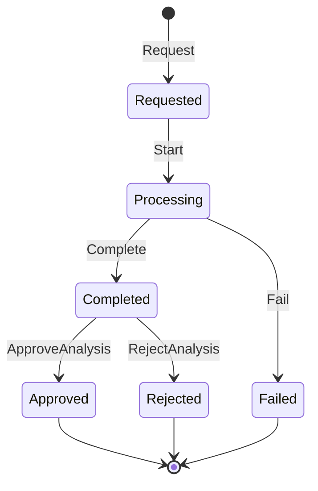

---

### 3.2 AI Model Aggregate

**Aggregate Root:** `AIModel`

#### Границы агрегата
**Включает:**
- AIModel (root entity)
- ModelVersion (entity collection)
- ModelMetrics (value object)
- TrainingData (value object)
- ModelConfiguration (value object)
- ValidationResults (value object)

**НЕ включает:**
- Файлы модели (хранятся в model registry)
- Результаты анализов (отдельный агрегат)
- Обучающие данные (только метаданные)

#### Ключи
- **Aggregate ID:** `AIModelId` (UUID)
- **Business Key:** `ModelName` + `Version` (уникальная комбинация)
- **Registry Key:** Ссылка на model registry (MLflow, etc.)

#### Инварианты
1. **Уникальность версии:** Комбинация (ModelName, Version) уникальна
2. **Семантическое версионирование:** Формат версии: MAJOR.MINOR.PATCH
3. **Статусы:** Development → Testing → Validation → Production → Deprecated
4. **Метрики производительности:**
   - Accuracy >= 0.85
   - Precision >= 0.80
   - Recall >= 0.80
   - F1-Score >= 0.80
5. **Валидация:** Обязательна перед переводом в Production
6. **Размер обучающей выборки:** Минимум 1000 изображений
7. **Типы моделей:** Classification, Detection, Segmentation
8. **Медицинские области:** Radiology, Pathology, Dermatology, etc.
9. **Регуляторное одобрение:** Обязательно для Production моделей
10. **Неизменяемость версий:** Production версии нельзя изменить

#### Команды
- `RegisterModel` - регистрация модели
- `CreateModelVersion` - создание новой версии
- `UpdateModelMetrics` - обновление метрик
- `ValidateModel` - валидация модели
- `PromoteToProduction` - перевод в продакшн
- `DeprecateModel` - устаревание модели
- `RollbackModel` - откат к предыдущей версии

#### События
- `AIModelRegistered`
- `ModelVersionCreated`
- `ModelMetricsUpdated`
- `ModelValidationCompleted`
- `ModelPromotedToProduction`
- `ModelDeprecated`
- `ModelRolledBack`

#### Жизненный цикл

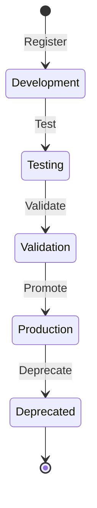

---

## 4. Data Context

### 4.1 Analytics Report Aggregate

**Aggregate Root:** `AnalyticsReport`

#### Границы агрегата
**Включает:**
- AnalyticsReport (root entity)
- ReportParameters (value object)
- ReportData (value object)
- Visualizations (entity collection)
- ReportSchedule (value object)

**НЕ включает:**
- Исходные данные (только агрегированные результаты)
- Data pipeline (только ссылка)
- Пользователи (только UserId)

#### Ключи
- **Aggregate ID:** `AnalyticsReportId` (UUID)
- **Foreign Keys:** `DataPipelineId`, `CreatedByUserId`
- **Business Key:** `ReportName` + `GeneratedAt`

#### Инварианты
1. **Обязательные параметры:** ReportName, ReportType, DateRange обязательны
2. **Типы отчётов:**
   - PatientDemographics
   - AppointmentStatistics
   - RevenueAnalysis
   - AIPerformanceMetrics
   - ClinicalOutcomes
3. **Временной диапазон:** StartDate <= EndDate
4. **Максимальный диапазон:** Не более 1 года для детальных отчётов
5. **Статусы:** Scheduled → Generating → Completed / Failed
6. **Формат данных:** JSON, CSV, PDF
7. **Размер отчёта:** Максимум 100 MB
8. **Расписание:** Cron-выражение для периодических отчётов
9. **Срок хранения:** Отчёты хранятся 3 года
10. **Конфиденциальность:** Деперсонализация данных обязательна

#### Команды
- `ScheduleReport` - планирование отчёта
- `GenerateReport` - генерация отчёта
- `AddVisualization` - добавление визуализации
- `ExportReport` - экспорт отчёта
- `ShareReport` - предоставление доступа
- `ArchiveReport` - архивирование отчёта
- `DeleteReport` - удаление отчёта

#### События
- `ReportScheduled`
- `ReportGenerationStarted`
- `ReportDataProcessed`
- `VisualizationCreated`
- `ReportCompleted`
- `ReportFailed`
- `ReportExported`
- `ReportShared`
- `ReportArchived`

#### Жизненный цикл

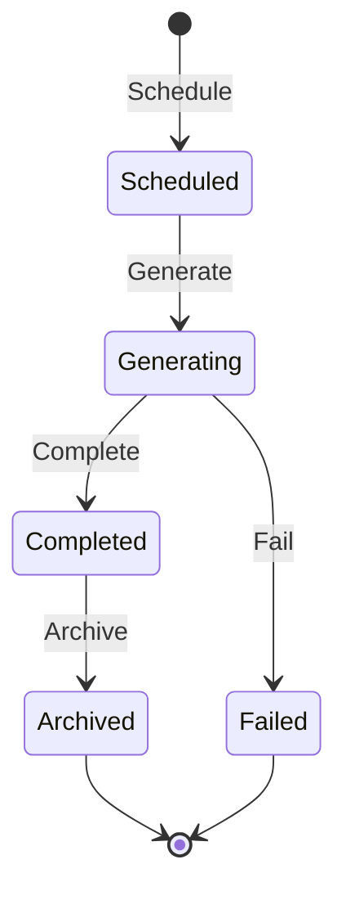

---

### 4.2 Data Pipeline Aggregate

**Aggregate Root:** `DataPipeline`

#### Границы агрегата
**Включает:**
- DataPipeline (root entity)
- PipelineStages (entity collection)
- PipelineConfiguration (value object)
- ExecutionHistory (entity collection)
- DataQualityMetrics (value object)

**НЕ включает:**
- Исходные данные (только метаданные)
- Целевые хранилища (только ссылки)
- Пользователи (только UserId)

#### Ключи
- **Aggregate ID:** `DataPipelineId` (UUID)
- **Business Key:** `PipelineName` (уникальное имя)
- **Execution Key:** `ExecutionId` (UUID для каждого запуска)

#### Инварианты
1. **Уникальность имени:** PipelineName уникально в системе
2. **Минимум один stage:** Pipeline должен содержать минимум один stage
3. **Последовательность stages:** Каждый stage имеет порядковый номер
4. **Зависимости:** Stage может зависеть только от предыдущих stages
5. **Статусы pipeline:** Idle → Running → Completed / Failed / Cancelled
6. **Статусы stage:** Pending → Running → Completed / Failed / Skipped
7. **Типы источников:** Database, API, FileSystem, MessageQueue, EventStream
8. **Типы назначений:** DataWarehouse, DataLake, OLAP, Cache
9. **Качество данных:**
   - Completeness >= 95%
   - Accuracy >= 98%
   - Consistency >= 99%
10. **Расписание:** Cron-выражение или event-driven trigger
11. **Retry policy:** Максимум 3 попытки при ошибке
12. **Timeout:** Максимальное время выполнения stage

#### Команды
- `CreatePipeline` - создание pipeline
- `AddStage` - добавление stage
- `UpdateConfiguration` - обновление конфигурации
- `StartPipeline` - запуск pipeline
- `PausePipeline` - приостановка pipeline
- `ResumePipeline` - возобновление pipeline
- `CancelPipeline` - отмена pipeline
- `RetryStage` - повтор stage
- `ValidateDataQuality` - проверка качества данных

#### События
- `PipelineCreated`
- `PipelineStageAdded`
- `PipelineConfigurationUpdated`
- `PipelineStarted`
- `PipelineStageStarted`
- `PipelineStageCompleted`
- `PipelineStageFailed`
- `DataQualityValidated`
- `PipelineCompleted`
- `PipelineFailed`
- `PipelineCancelled`

#### Жизненный цикл

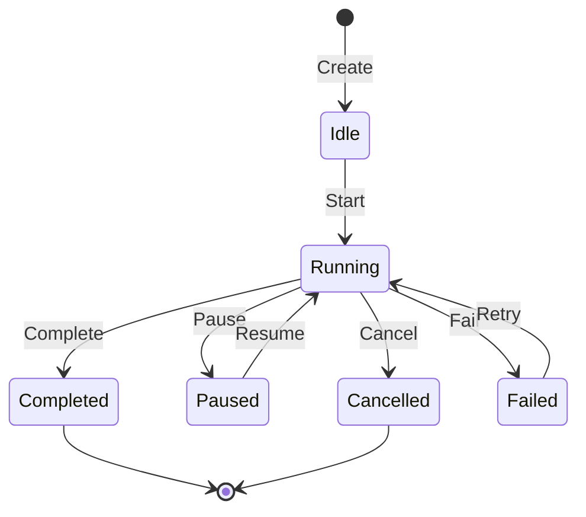

---

## Общие принципы проектирования агрегатов

### 1. Размер агрегата
- **Малые агрегаты:** Предпочтительны для лучшей производительности и масштабируемости
- **Правило:** Один агрегат = одна транзакция
- **Избегать:** Больших графов объектов внутри агрегата

### 2. Границы агрегата
- **Чёткие границы:** Агрегат инкапсулирует связанные данные и бизнес-логику
- **Ссылки по ID:** Между агрегатами только ссылки по идентификаторам
- **Eventual consistency:** Между агрегатами через события

### 3. Инварианты
- **Строгая консистентность:** Внутри агрегата
- **Бизнес-правила:** Все инварианты проверяются в агрегате
- **Валидация:** При каждой команде

### 4. Идентификация
- **Aggregate ID:** Уникальный технический идентификатор (UUID)
- **Business Key:** Бизнес-идентификатор для пользователей
- **Foreign Keys:** Ссылки на другие агрегаты

### 5. Жизненный цикл
- **Создание:** Через команду с валидацией
- **Изменение:** Только через команды агрегата
- **Удаление:** Soft delete с аудитом (где применимо)

### 6. События
- **Факты:** События описывают то, что произошло
- **Неизменяемость:** События нельзя изменить или удалить
- **Полнота:** События содержат всю необходимую информацию
- **Порядок:** События упорядочены по времени

### 7. Команды
- **Намерение:** Команды выражают намерение изменить состояние
- **Валидация:** Команды валидируются перед выполнением
- **Идемпотентность:** Команды должны быть идемпотентными (где возможно)
- **Отказ:** Команды могут быть отклонены

### 8. Консистентность
- **Strong consistency:** Внутри агрегата (ACID)
- **Eventual consistency:** Между агрегатами (BASE)
- **Saga pattern:** Для распределённых транзакций
- **Компенсация:** Для отката изменений

### 9. Производительность
- **Оптимистичная блокировка:** Через версионирование
- **Кэширование:** Агрегатов в памяти
- **Снапшоты:** Для больших event streams
- **Партиционирование:** По aggregate ID

### 10. Безопасность
- **Авторизация:** На уровне команд
- **Аудит:** Все изменения логируются
- **Шифрование:** Чувствительных данных
- **Конфиденциальность:** Соблюдение ФЗ-152

---

## Паттерны взаимодействия агрегатов

### 1. Event-Driven Communication
```
Aggregate A --публикует--> Event --подписывается--> Aggregate B
```

**Пример:**
```
Appointment --публикует--> AppointmentCompleted --подписывается--> Invoice
Invoice создаёт счёт на основе завершённого приёма
```

### 2. Saga Pattern
```
Orchestrator --команда--> Aggregate A --событие--> Orchestrator --команда--> Aggregate B
```

**Пример: Процесс оплаты с кредитом**
```
1. PaymentSaga --CreateInvoice--> Invoice --InvoiceCreated--> PaymentSaga
2. PaymentSaga --CreateLoanApplication--> LoanApplication --LoanApplicationCreated--> PaymentSaga
3. PaymentSaga --SubmitLoanApplication--> LoanApplication --LoanApplicationSubmitted--> PaymentSaga
4. PaymentSaga --ApproveLoanApplication--> LoanApplication --LoanApplicationApproved--> PaymentSaga
5. PaymentSaga --InitiatePayment--> Payment --PaymentCompleted--> PaymentSaga
6. PaymentSaga --MarkInvoicePaid--> Invoice --InvoiceFullyPaid--> PaymentSaga
```

### 3. Policy Pattern
```
Event --триггер--> Policy --команда--> Aggregate
```

**Пример:**
```
AppointmentCompleted --триггер--> CreateInvoicePolicy --CreateInvoice--> Invoice
```

### 4. Process Manager Pattern
```
Process Manager координирует долгоживущие бизнес-процессы
```

**Пример: Процесс лечения пациента**
```
PatientTreatmentProcess:
1. Регистрация пациента
2. Запись на приём
3. Проведение приёма
4. Назначение анализов/изображений
5. AI анализ (если нужно)
6. Постановка диагноза
7. Назначение лечения
8. Выставление счёта
9. Оплата
```

---

## Технические рекомендации

### 1. Хранение агрегатов

**Event Sourcing:**
```
Aggregate State = Σ(Events)
```

**Преимущества:**
- Полная история изменений
- Аудит из коробки
- Возможность replay событий
- Временные запросы (time travel)

**Снапшоты:**
```
Snapshot каждые N событий (например, каждые 100)
Aggregate State = Snapshot + Events(after snapshot)
```

### 2. Версионирование

**Оптимистичная блокировка:**
```sql
UPDATE aggregates
SET data = ?, version = version + 1
WHERE id = ? AND version = ?
```

**Event versioning:**
```json
{
  "eventType": "PatientRegistered",
  "eventVersion": "v2",
  "data": { ... }
}
```

### 3. Производительность

**Кэширование:**
- In-memory cache для часто используемых агрегатов
- TTL: 5-15 минут
- Invalidation при изменении

**Партиционирование:**
- По aggregate ID
- По tenant ID (для multi-tenancy)
- По временным диапазонам

### 4. Мониторинг

**Метрики:**
- Время обработки команд
- Количество событий на агрегат
- Размер агрегата
- Частота конфликтов версий

**Алерты:**
- Медленные команды (> 1 сек)
- Большие агрегаты (> 1000 событий)
- Высокая частота конфликтов (> 5%)

---

## Заключение

Данная модель агрегатов обеспечивает:

1. **Чёткие границы:** Каждый агрегат имеет определённую ответственность
2. **Консистентность:** Инварианты поддерживаются внутри агрегатов
3. **Масштабируемость:** Малые агрегаты, eventual consistency между ними
4. **Аудит:** Все изменения через события
5. **Гибкость:** Легко добавлять новые агрегаты и изменять существующие
6. **Производительность:** Оптимизация через кэширование и партиционирование
7. **Безопасность:** Контроль доступа на уровне команд
8. **Соответствие требованиям:** ФЗ-152, медицинские стандарты

Агрегаты спроектированы с учётом:
- Domain-Driven Design принципов
- Event Sourcing паттернов
- CQRS архитектуры
- Микросервисной архитектуры
- Cloud-native подходов
