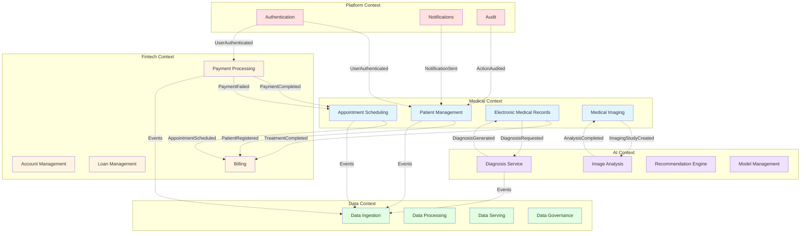

# Bounded Contexts - Domain-Driven Design

## Обзор доменной модели

Система «Будущее 2.0» разделена на 4 основных bounded context в соответствии с бизнес-доменами:

1. **Medical Context** - Медицинские услуги
2. **Fintech Context** - Финансовые услуги
3. **AI Context** - Искусственный интеллект
4. **Data Context** - Аналитика и данные

---

## Диаграмма Bounded Contexts

---

## 1. Medical Context (Медицинский контекст)

### Описание
Управление медицинскими услугами, пациентами, записями на прием и медицинскими картами.

### Bounded Contexts

#### 1.1 Patient Management (Управление пациентами)

**Ответственность:**
- Регистрация и управление данными пациентов
- Управление профилями пациентов
- История взаимодействий с клиникой

**Ключевые сущности:**
- Patient (Пациент)
- PatientProfile (Профиль пациента)
- ContactInformation (Контактная информация)
- InsurancePolicy (Страховой полис)

**Агрегаты:**
- Patient Aggregate (root: Patient)

**Границы:**
- НЕ содержит медицинские данные (диагнозы, лечение)
- НЕ содержит финансовую информацию
- НЕ управляет записями на прием

**Интеграции:**
- Публикует: PatientRegistered, PatientUpdated, PatientDeactivated
- Подписывается: PaymentCompleted (для активации услуг)

---

#### 1.2 Appointment Scheduling (Запись на прием)

**Ответственность:**
- Управление расписанием врачей
- Запись пациентов на прием
- Управление доступностью слотов

**Ключевые сущности:**
- Appointment (Запись на прием)
- Schedule (Расписание)
- TimeSlot (Временной слот)
- Doctor (Врач)

**Агрегаты:**
- Appointment Aggregate (root: Appointment)
- Schedule Aggregate (root: Schedule)

**Границы:**
- НЕ содержит медицинские данные о приеме
- НЕ обрабатывает платежи
- НЕ управляет медицинскими картами

**Интеграции:**
- Публикует: AppointmentScheduled, AppointmentCancelled, AppointmentCompleted
- Подписывается: PatientRegistered, PaymentCompleted, PaymentFailed

---

#### 1.3 Electronic Medical Records (Электронные медкарты)

**Ответственность:**
- Хранение медицинских записей
- Управление диагнозами и лечением
- История болезни

**Ключевые сущности:**
- MedicalRecord (Медицинская карта)
- Diagnosis (Диагноз)
- Treatment (Лечение)
- Prescription (Рецепт)
- VitalSigns (Жизненные показатели)

**Агрегаты:**
- MedicalRecord Aggregate (root: MedicalRecord)

**Границы:**
- НЕ управляет пациентами (только ссылается)
- НЕ обрабатывает платежи
- НЕ выполняет AI анализ

**Интеграции:**
- Публикует: DiagnosisCreated, TreatmentStarted, TreatmentCompleted, PrescriptionIssued
- Подписывается: AppointmentCompleted, DiagnosisGenerated (from AI)

---

#### 1.4 Medical Imaging (Медицинские снимки)

**Ответственность:**
- Хранение медицинских изображений
- Управление исследованиями
- Интеграция с медицинским оборудованием

**Ключевые сущности:**
- ImagingStudy (Исследование)
- Image (Изображение)
- Modality (Модальность: CT, MRI, X-Ray)
- Report (Отчет)

**Агрегаты:**
- ImagingStudy Aggregate (root: ImagingStudy)

**Границы:**
- НЕ выполняет AI анализ (делегирует AI Context)
- НЕ управляет медицинскими картами
- НЕ обрабатывает платежи

**Интеграции:**
- Публикует: ImagingStudyCreated, ImagingStudyCompleted
- Подписывается: AnalysisCompleted (from AI)

---

## 2. Fintech Context (Финансовый контекст)

### Описание
Управление финансовыми операциями, платежами, кредитами и счетами.

### Bounded Contexts

#### 2.1 Account Management (Управление счетами)

**Ответственность:**
- Управление банковскими счетами
- Баланс и транзакции
- Выписки

**Ключевые сущности:**
- Account (Счет)
- Balance (Баланс)
- Transaction (Транзакция)
- Statement (Выписка)

**Агрегаты:**
- Account Aggregate (root: Account)

**Границы:**
- НЕ обрабатывает платежи (делегирует Payment Processing)
- НЕ управляет кредитами
- НЕ выставляет счета

**Интеграции:**
- Публикует: AccountCreated, AccountClosed, BalanceChanged
- Подписывается: PaymentCompleted, LoanDisbursed

---

#### 2.2 Payment Processing (Обработка платежей)

**Ответственность:**
- Обработка платежей
- Интеграция с платежными системами
- Возвраты и отмены

**Ключевые сущности:**
- Payment (Платеж)
- PaymentMethod (Способ оплаты)
- Refund (Возврат)
- PaymentGateway (Платежный шлюз)

**Агрегаты:**
- Payment Aggregate (root: Payment)

**Границы:**
- НЕ управляет счетами
- НЕ выставляет счета
- НЕ управляет кредитами

**Интеграции:**
- Публикует: PaymentInitiated, PaymentCompleted, PaymentFailed, RefundProcessed
- Подписывается: InvoiceCreated, AppointmentScheduled

---

#### 2.3 Loan Management (Управление кредитами)

**Ответственность:**
- Управление кредитными продуктами
- Оценка кредитоспособности
- График платежей

**Ключевые сущности:**
- Loan (Кредит)
- LoanApplication (Заявка на кредит)
- PaymentSchedule (График платежей)
- CreditScore (Кредитный рейтинг)

**Агрегаты:**
- Loan Aggregate (root: Loan)

**Границы:**
- НЕ обрабатывает платежи (делегирует Payment Processing)
- НЕ управляет счетами
- НЕ выставляет счета

**Интеграции:**
- Публикует: LoanApplicationSubmitted, LoanApproved, LoanDisbursed, LoanRepaid
- Подписывается: PaymentCompleted, CreditScoreUpdated

---

#### 2.4 Billing (Выставление счетов)

**Ответственность:**
- Формирование счетов
- Расчет стоимости услуг
- Управление тарифами

**Ключевые сущности:**
- Invoice (Счет)
- InvoiceItem (Позиция счета)
- PriceList (Прайс-лист)
- Discount (Скидка)

**Агрегаты:**
- Invoice Aggregate (root: Invoice)

**Границы:**
- НЕ обрабатывает платежи
- НЕ управляет медицинскими услугами
- НЕ управляет кредитами

**Интеграции:**
- Публикует: InvoiceCreated, InvoicePaid, InvoiceCancelled
- Подписывается: AppointmentCompleted, TreatmentCompleted, PaymentCompleted

---

## 3. AI Context (Контекст искусственного интеллекта)

### Описание
Предоставление AI-сервисов для диагностики, анализа изображений и рекомендаций.

### Bounded Contexts

#### 3.1 Diagnosis Service (Сервис диагностики)

**Ответственность:**
- AI-диагностика на основе симптомов
- Рекомендации по лечению
- Оценка рисков

**Ключевые сущности:**
- DiagnosisRequest (Запрос на диагностику)
- DiagnosisResult (Результат диагностики)
- Symptom (Симптом)
- RiskAssessment (Оценка рисков)

**Агрегаты:**
- DiagnosisRequest Aggregate (root: DiagnosisRequest)

**Границы:**
- НЕ хранит медицинские карты
- НЕ управляет пациентами
- НЕ анализирует изображения (делегирует Image Analysis)

**Интеграции:**
- Публикует: DiagnosisGenerated, RiskAssessed
- Подписывается: DiagnosisRequested (from Medical)

---

#### 3.2 Image Analysis (Анализ изображений)

**Ответственность:**
- AI-анализ медицинских снимков
- Обнаружение патологий
- Сегментация изображений

**Ключевые сущности:**
- AnalysisRequest (Запрос на анализ)
- AnalysisResult (Результат анализа)
- Finding (Находка)
- Confidence (Уверенность)

**Агрегаты:**
- AnalysisRequest Aggregate (root: AnalysisRequest)

**Границы:**
- НЕ хранит изображения (читает из Medical Imaging)
- НЕ создает медицинские записи
- НЕ управляет моделями (делегирует Model Management)

**Интеграции:**
- Публикует: AnalysisCompleted, PathologyDetected
- Подписывается: ImagingStudyCreated

---

#### 3.3 Recommendation Engine (Движок рекомендаций)

**Ответственность:**
- Персонализированные рекомендации
- Предсказание потребностей
- Оптимизация лечения

**Ключевые сущности:**
- Recommendation (Рекомендация)
- UserProfile (Профиль пользователя)
- Preference (Предпочтение)

**Агрегаты:**
- Recommendation Aggregate (root: Recommendation)

**Границы:**
- НЕ принимает решения о лечении
- НЕ управляет пациентами
- НЕ выполняет диагностику

**Интеграции:**
- Публикует: RecommendationGenerated
- Подписывается: DiagnosisGenerated, TreatmentCompleted

---

#### 3.4 Model Management (Управление моделями)

**Ответственность:**
- Версионирование ML моделей
- A/B тестирование
- Мониторинг производительности

**Ключевые сущности:**
- Model (Модель)
- ModelVersion (Версия модели)
- Experiment (Эксперимент)
- Metrics (Метрики)

**Агрегаты:**
- Model Aggregate (root: Model)

**Границы:**
- НЕ выполняет inference
- НЕ обучает модели (делегирует внешним системам)
- НЕ управляет данными для обучения

**Интеграции:**
- Публикует: ModelDeployed, ModelRetired
- Подписывается: ModelPerformanceDegraded

---

## 4. Data Context (Контекст данных и аналитики)

### Описание
Управление данными, аналитикой и витриной данных.

### Bounded Contexts

#### 4.1 Data Ingestion (Загрузка данных)

**Ответственность:**
- Потребление событий из Kafka
- CDC из источников
- Валидация данных

**Ключевые сущности:**
- DataStream (Поток данных)
- DataSource (Источник данных)
- ValidationRule (Правило валидации)

**Агрегаты:**
- DataStream Aggregate (root: DataStream)

**Границы:**
- НЕ обрабатывает данные
- НЕ предоставляет данные пользователям
- НЕ управляет качеством (делегирует Data Governance)

**Интеграции:**
- Публикует: DataIngested, ValidationFailed
- Подписывается: Все доменные события

---

#### 4.2 Data Processing (Обработка данных)

**Ответственность:**
- Трансформация данных
- Агрегация метрик
- Обогащение данных

**Ключевые сущности:**
- Pipeline (Пайплайн)
- Transformation (Трансформация)
- Aggregation (Агрегация)

**Агрегаты:**
- Pipeline Aggregate (root: Pipeline)

**Границы:**
- НЕ загружает данные
- НЕ предоставляет данные пользователям
- НЕ управляет хранилищем

**Интеграции:**
- Публикует: DataProcessed, PipelineFailed
- Подписывается: DataIngested

---

#### 4.3 Data Serving (Предоставление данных)

**Ответственность:**
- Предоставление данных через API
- Кэширование
- Оптимизация запросов

**Ключевые сущности:**
- Query (Запрос)
- Dataset (Датасет)
- Cache (Кэш)

**Агрегаты:**
- Query Aggregate (root: Query)

**Границы:**
- НЕ обрабатывает данные
- НЕ управляет доступом (делегирует Data Governance)
- НЕ хранит данные

**Интеграции:**
- Публикует: QueryExecuted, CacheHit
- Подписывается: DataProcessed

---

#### 4.4 Data Governance (Управление данными)

**Ответственность:**
- Контроль качества данных
- Управление доступом
- Линейдж данных

**Ключевые сущности:**
- DataQualityRule (Правило качества)
- AccessPolicy (Политика доступа)
- Lineage (Линейдж)

**Агрегаты:**
- DataQualityRule Aggregate (root: DataQualityRule)

**Границы:**
- НЕ обрабатывает данные
- НЕ загружает данные
- НЕ предоставляет данные

**Интеграции:**
- Публикует: QualityIssueDetected, AccessViolation
- Подписывается: DataIngested, DataProcessed

---

## 5. Platform Context (Платформенный контекст)

### Описание
Общие платформенные сервисы, используемые всеми доменами.

### Bounded Contexts

#### 5.1 Authentication & Authorization

**Ответственность:**
- Аутентификация пользователей
- Управление ролями и правами
- SSO

**Интеграции:**
- Публикует: UserAuthenticated, UserLoggedOut, PermissionGranted

---

#### 5.2 Notifications

**Ответственность:**
- Отправка уведомлений (email, SMS, push)
- Управление шаблонами
- Отслеживание доставки

**Интеграции:**
- Публикует: NotificationSent, NotificationFailed
- Подписывается: Все доменные события (по необходимости)

---

#### 5.3 Audit

**Ответственность:**
- Аудит действий пользователей
- Логирование изменений
- Compliance

**Интеграции:**
- Публикует: ActionAudited
- Подписывается: Все доменные события

---

## Context Map (Карта контекстов)

### Типы отношений между контекстами

**Upstream-Downstream:**
- Medical → Fintech (Customer-Supplier)
- Medical → AI (Customer-Supplier)
- All → Data (Conformist)

**Shared Kernel:**
- Нет (все контексты независимы)

**Anti-Corruption Layer:**
- Между всеми контекстами (через события)

**Published Language:**
- Avro схемы событий в Schema Registry

---

## Принципы разделения

### 1. Бизнес-ориентированность
Каждый контекст соответствует бизнес-домену и может развиваться независимо.

### 2. Автономность
Контексты не зависят друг от друга напрямую, интеграция только через события.

### 3. Единый язык (Ubiquitous Language)
Внутри каждого контекста используется единый язык, понятный бизнесу и разработчикам.

### 4. Ограниченная ответственность
Каждый контекст отвечает только за свою область, не вмешиваясь в другие.

### 5. Событийная интеграция
Контексты взаимодействуют через доменные события, обеспечивая слабую связанность.

---

## Преимущества такого разделения

1. **Независимое развитие**: Каждая команда может работать над своим контекстом
2. **Масштабируемость**: Контексты масштабируются независимо
3. **Отказоустойчивость**: Сбой одного контекста не влияет на другие
4. **Гибкость**: Легко добавлять новые контексты (фармацевтика, оборудование)
5. **Понятность**: Четкие границы и ответственность
