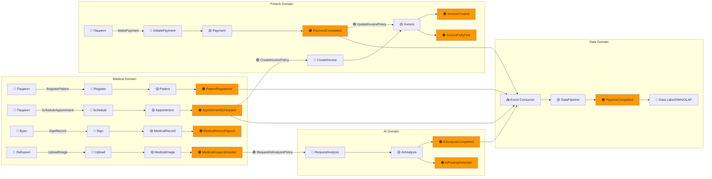
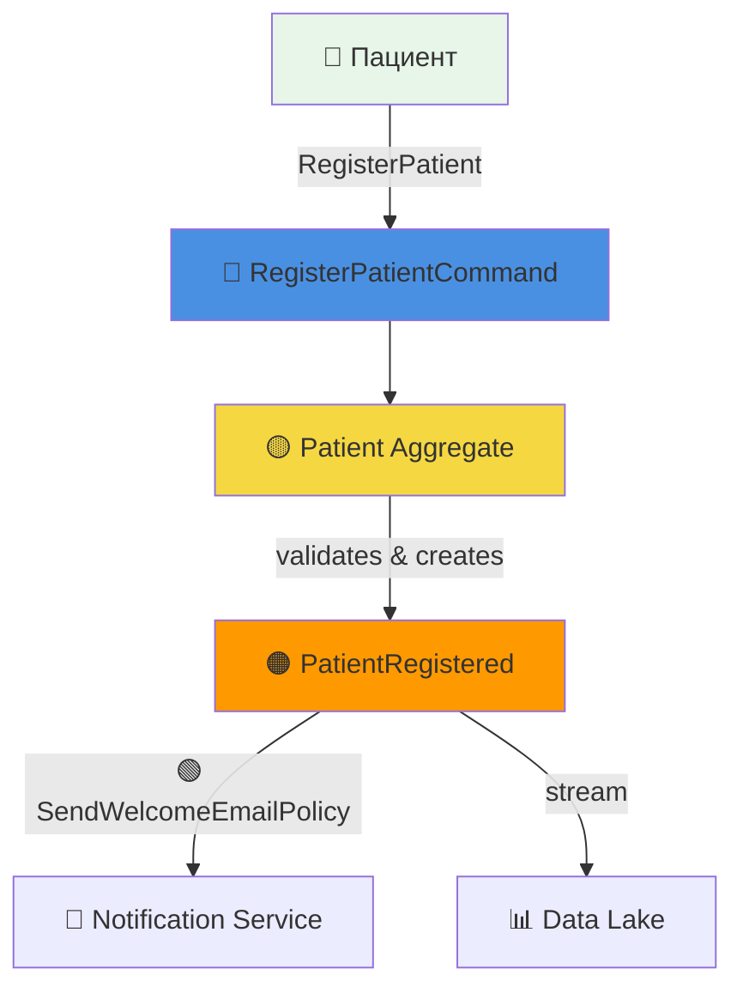
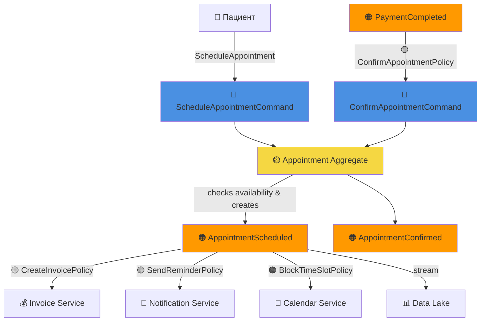
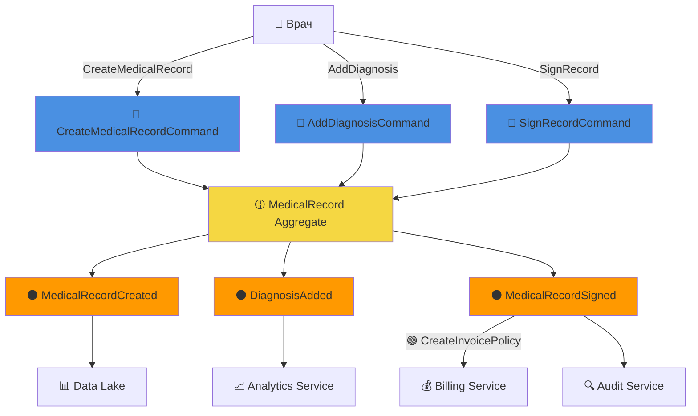
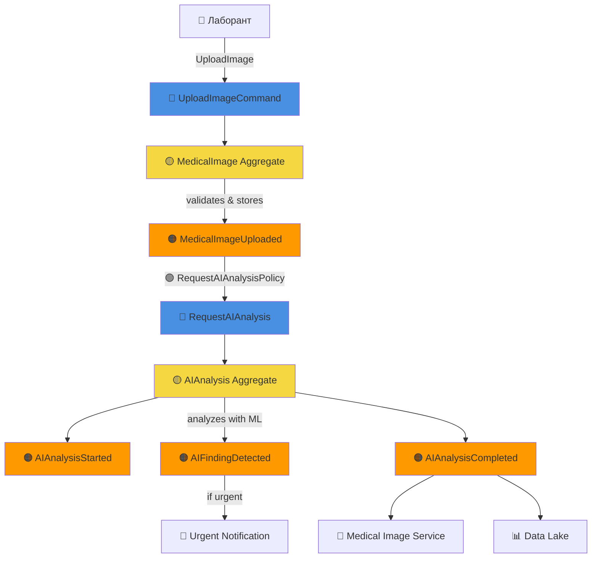
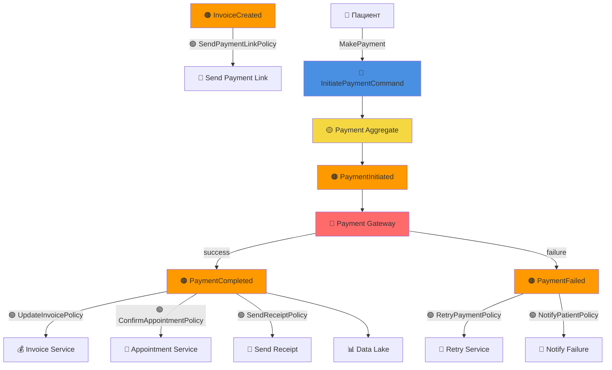
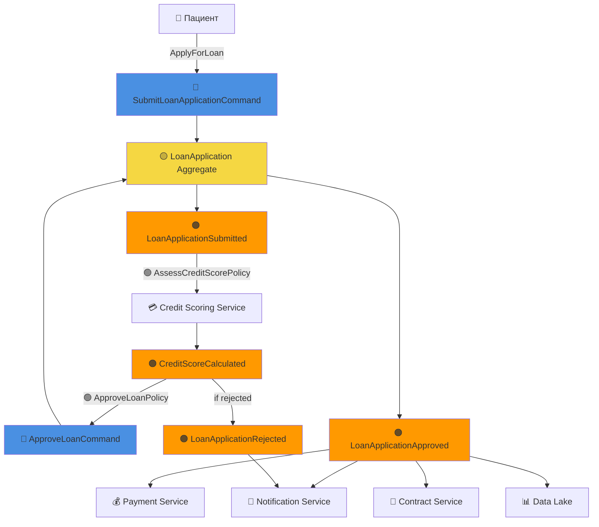
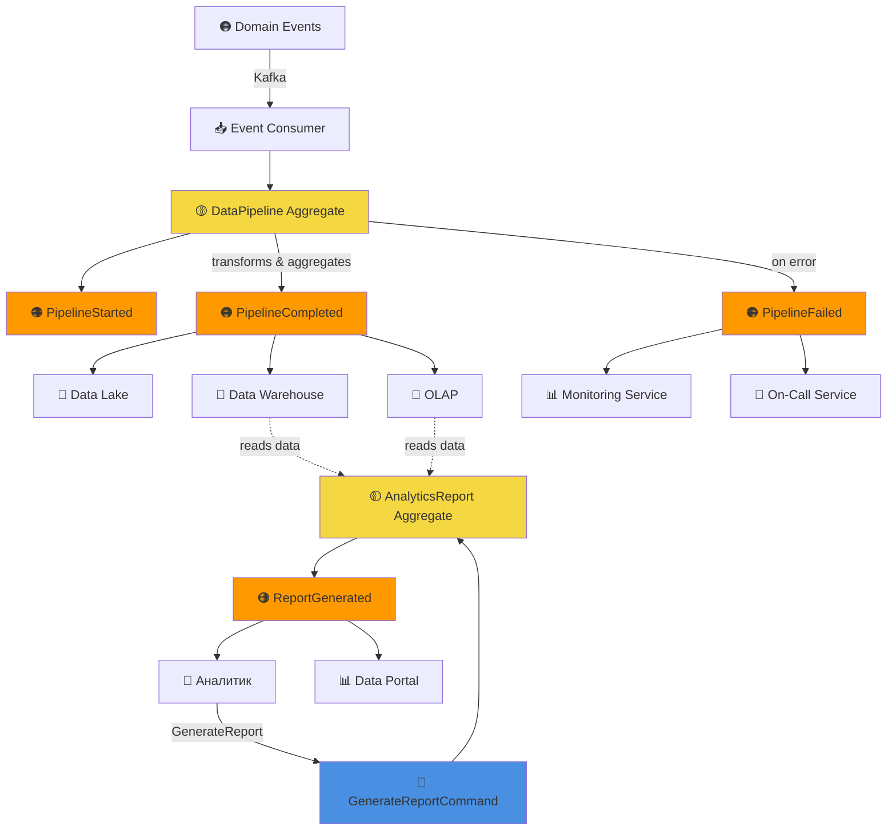

# Event Storming - Событийная архитектура "Будущее 2.0"

## Обзор

Event Storming - это метод моделирования бизнес-процессов через события. В этом документе представлена событийная архитектура системы «Будущее 2.0».

### Легенда

- 🟠 **Event** (Событие) - что-то произошло в системе
- 🔵 **Command** (Команда) - действие пользователя или системы
- 🟡 **Aggregate** (Агрегат) - бизнес-сущность, обрабатывающая команды
- 🟢 **Policy** (Политика) - автоматическая реакция на событие
- 🔴 **External System** (Внешняя система)
- 👤 **Actor** (Актор) - пользователь или система

---

## Event Flow Diagram

---

## Детальные Event Flows

### 1. Patient Registration Flow (Регистрация пациента)

**Участники:**
- **Actor**: Пациент, Оператор
- **Aggregate**: Patient
- **Events**: PatientRegistered
- **Policies**: SendWelcomeEmailPolicy
- **Downstream**: Notification Service, Data Lake

---

### 2. Appointment Scheduling Flow (Запись на прием)

**Участники:**
- **Actor**: Пациент, Оператор
- **Aggregate**: Appointment, Schedule
- **Events**: AppointmentScheduled, AppointmentConfirmed, TimeSlotBlocked
- **Policies**: CreateInvoicePolicy, SendReminderPolicy, BlockTimeSlotPolicy, ConfirmAppointmentPolicy
- **Downstream**: Fintech (Invoice, Payment), Platform (Notifications), Data

---

### 3. Medical Treatment Flow (Медицинское лечение)

**Участники:**
- **Actor**: Врач
- **Aggregate**: MedicalRecord
- **Events**: MedicalRecordCreated, DiagnosisAdded, MedicalRecordSigned
- **Policies**: CreateInvoicePolicy
- **Downstream**: Billing Service, Analytics Service, Audit Service, Data Lake

---

### 4. Medical Imaging & AI Analysis Flow (Медицинские снимки и AI анализ)

**Участники:**
- **Actor**: Лаборант, AI System
- **Aggregate**: MedicalImage, AIAnalysis
- **Events**: MedicalImageUploaded, AIAnalysisStarted, AIFindingDetected, AIAnalysisCompleted
- **Policies**: RequestAIAnalysisPolicy
- **Downstream**: AI Analysis Service, Medical Image Service, Notification Service, Data Lake

---

### 5. Payment Processing Flow (Обработка платежей)

**Участники:**
- **Actor**: Пациент
- **Aggregate**: Payment
- **Events**: PaymentInitiated, PaymentCompleted, PaymentFailed
- **Policies**: SendPaymentLinkPolicy, UpdateInvoicePolicy, ConfirmAppointmentPolicy, SendReceiptPolicy, RetryPaymentPolicy, NotifyPatientPolicy
- **Downstream**: Invoice Service, Appointment Service, Notification Service, Data Lake
- **External**: Payment Gateway

---

### 6. Loan Application Flow (Заявка на кредит)

**Участники:**
- **Actor**: Пациент
- **Aggregate**: LoanApplication
- **Events**: LoanApplicationSubmitted, LoanApplicationApproved, LoanApplicationRejected
- **Policies**: AssessCreditScorePolicy, ApproveLoanPolicy
- **Downstream**: Credit Scoring Service, Payment Service, Notification Service, Contract Service, Data Lake

---

### 7. Data Analytics Flow (Аналитика данных)

**Участники:**
- **Actor**: Аналитик
- **Aggregate**: DataPipeline, AnalyticsReport
- **Events**: PipelineStarted, PipelineCompleted, PipelineFailed, ReportGenerated
- **Policies**: None (event-driven processing)
- **Upstream**: All domain events via Kafka
- **Storage**: Data Lake, Data Warehouse, OLAP

---

## Event Catalog Summary

### Medical Domain Events

| Event | Aggregate | Trigger | Subscribers |
|-------|-----------|---------|-------------|
| PatientRegistered | Patient | RegisterPatient command | Appointment Service, Billing Service, Analytics Service, Notification Service |
| PatientInfoUpdated | Patient | UpdatePatient command | Notification Service, Analytics Service |
| AppointmentScheduled | Appointment | ScheduleAppointment command | Billing Service, Notification Service, Calendar Service, Analytics Service |
| AppointmentConfirmed | Appointment | PaymentCompleted event | Notification Service, Analytics Service |
| AppointmentCancelled | Appointment | CancelAppointment command | Billing Service, Notification Service, Calendar Service, Analytics Service |
| AppointmentCompleted | Appointment | CompleteAppointment command | Medical Record Service, Billing Service, Analytics Service |
| MedicalRecordCreated | MedicalRecord | CreateMedicalRecord command | Analytics Service, Audit Service |
| DiagnosisAdded | MedicalRecord | AddDiagnosis command | Analytics Service, Clinical Decision Support, Quality Assurance |
| PrescriptionAdded | MedicalRecord | AddPrescription command | Pharmacy Service, Drug Interaction Service, Analytics Service |
| MedicalRecordSigned | MedicalRecord | SignRecord command | Audit Service, Analytics Service, Patient Portal |
| MedicalImageUploaded | MedicalImage | UploadImage command | AI Analysis Service, PACS Integration, Analytics Service |
| AIAnalysisRequested | MedicalImage | RequestAIAnalysis command | AI Analysis Service |

### Fintech Domain Events

| Event | Aggregate | Trigger | Subscribers |
|-------|-----------|---------|-------------|
| InvoiceCreated | Invoice | CreateInvoice command | Payment Service, Notification Service, Analytics Service |
| InvoiceIssued | Invoice | IssueInvoice command | Notification Service, Payment Service, Analytics Service |
| InvoiceFullyPaid | Invoice | PaymentCompleted event | Notification Service, Analytics Service, Accounting Service |
| PaymentInitiated | Payment | InitiatePayment command | Payment Gateway, Analytics Service |
| PaymentCompleted | Payment | Payment Gateway response | Invoice Service, Notification Service, Analytics Service, Accounting Service |
| PaymentFailed | Payment | Payment Gateway response | Notification Service, Analytics Service, Retry Service |
| LoanApplicationSubmitted | LoanApplication | SubmitApplication command | Credit Scoring Service, Notification Service, Analytics Service |
| LoanApplicationApproved | LoanApplication | ApproveApplication command | Payment Service, Notification Service, Analytics Service, Contract Service |
| LoanApplicationRejected | LoanApplication | RejectApplication command | Notification Service, Analytics Service |

### AI Domain Events

| Event | Aggregate | Trigger | Subscribers |
|-------|-----------|---------|-------------|
| AIAnalysisStarted | AIAnalysis | StartProcessing command | Monitoring Service, Analytics Service |
| AIFindingDetected | AIAnalysis | AI detection | Medical Record Service, Notification Service, Analytics Service |
| AIAnalysisCompleted | AIAnalysis | CompleteAnalysis command | Medical Image Service, Notification Service, Analytics Service, Quality Assurance |
| AIModelRegistered | AIModel | RegisterModel command | Model Monitoring Service, Analytics Service |
| ModelPromotedToProduction | AIModel | PromoteToProduction command | AI Analysis Service, Notification Service, Analytics Service |

### Data Domain Events

| Event | Aggregate | Trigger | Subscribers |
|-------|-----------|---------|-------------|
| ReportGenerated | AnalyticsReport | GenerateReport command | Notification Service, Audit Service |
| PipelineStarted | DataPipeline | StartPipeline command | Monitoring Service, Analytics Service |
| PipelineCompleted | DataPipeline | Pipeline completion | Monitoring Service, Analytics Service, Data Quality Service |
| PipelineFailed | DataPipeline | Pipeline error | Monitoring Service, Data Quality Service, On-Call Service |

### Platform Domain Events

| Event | Aggregate | Trigger | Subscribers |
|-------|-----------|---------|-------------|
| UserLoggedIn | User | Login command | Audit Service, Security Service, Analytics Service |
| UserLoggedOut | User | Logout command | Audit Service, Analytics Service |
| SystemHealthCheckFailed | HealthCheck | Health check failure | Alerting Service, Incident Management, On-Call Service |

---

## Event Patterns

### 1. Event Sourcing
Некоторые агрегаты (Payment, Loan) используют Event Sourcing для полной истории изменений.

### 2. CQRS
Разделение команд (write) и запросов (read) через события и read models.

### 3. Saga Pattern
Распределенные транзакции через события (например, Payment → Invoice → Appointment).

### 4. Event Notification
Простое уведомление о произошедшем событии.

### 5. Event-Carried State Transfer
События содержат достаточно данных для обработки без дополнительных запросов.

---

## Преимущества событийной архитектуры

1. **Слабая связанность**: Домены не знают друг о друге
2. **Масштабируемость**: Легко добавлять новых подписчиков
3. **Аудит**: Полная история событий
4. **Отказоустойчивость**: Сбой одного домена не влияет на другие
5. **Гибкость**: Легко изменять бизнес-процессы
6. **Real-time**: Near-real-time обработка событий
